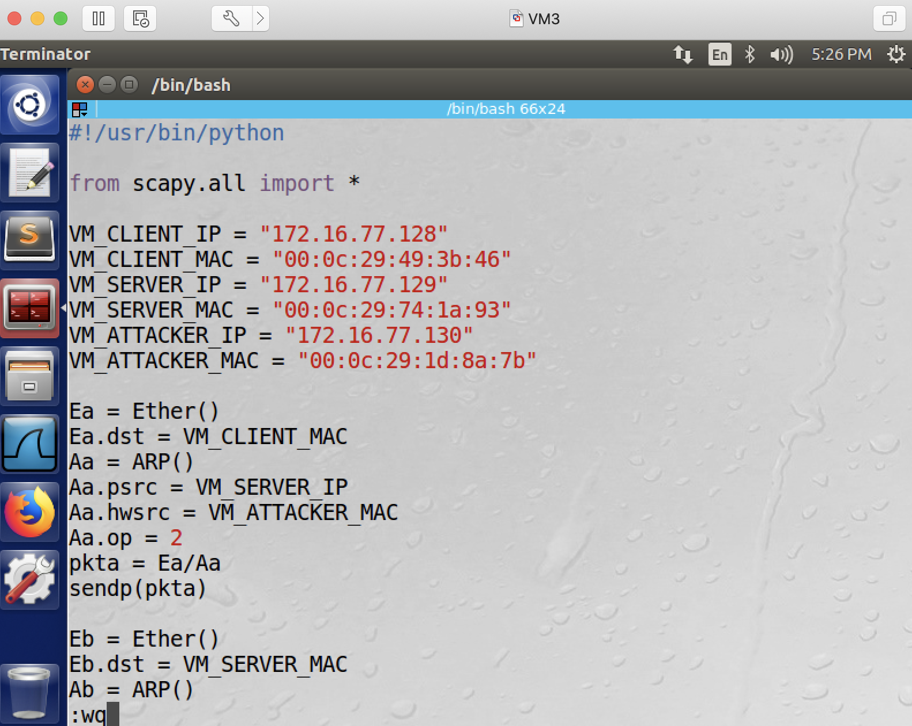
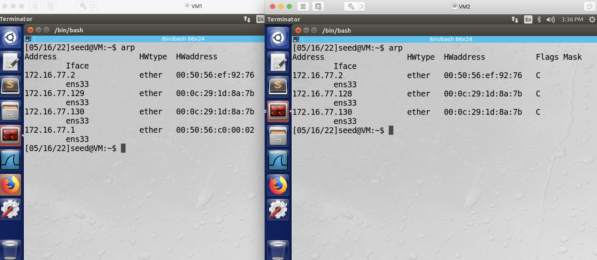
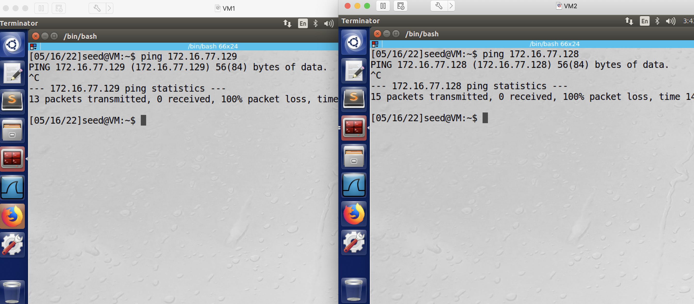
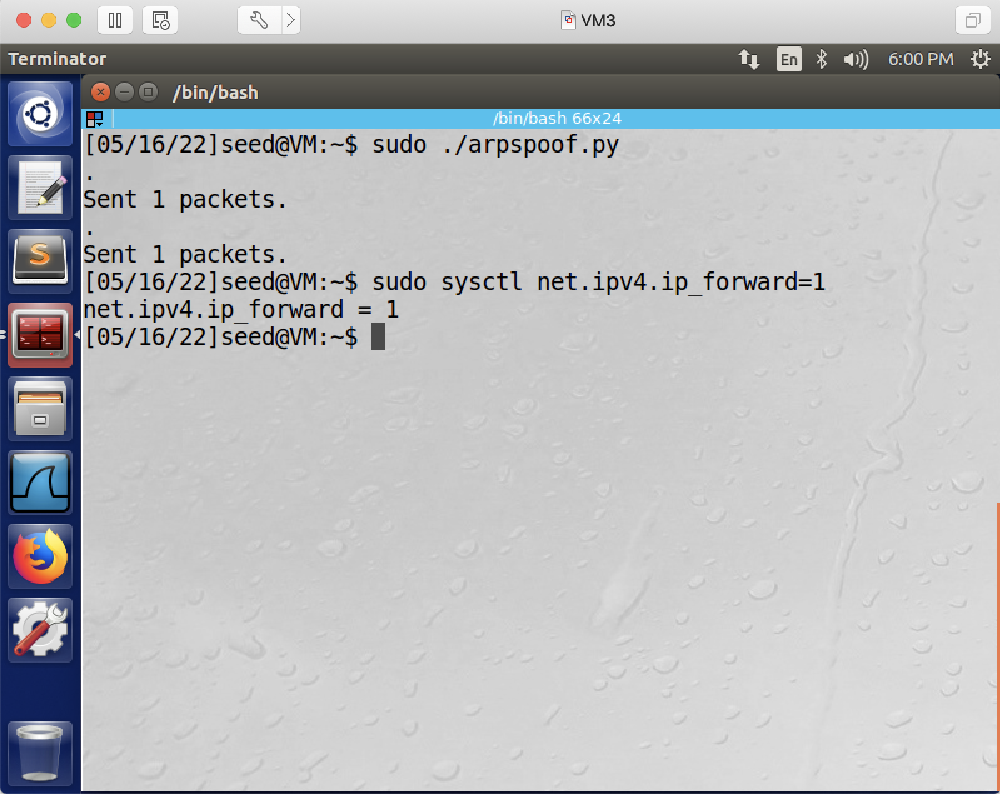
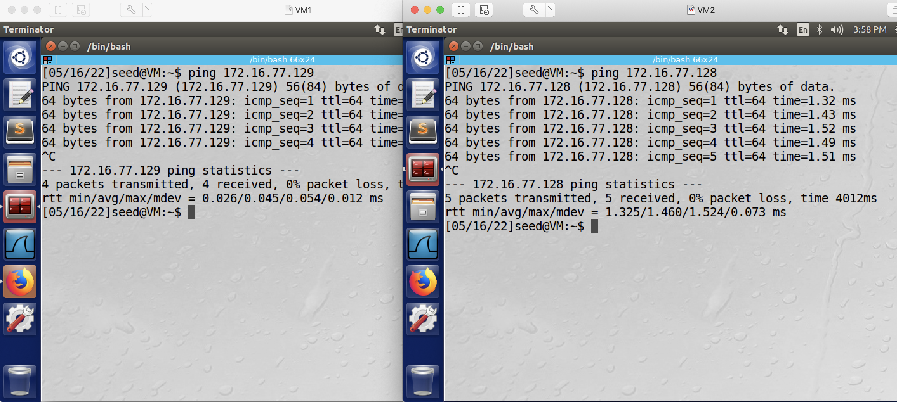
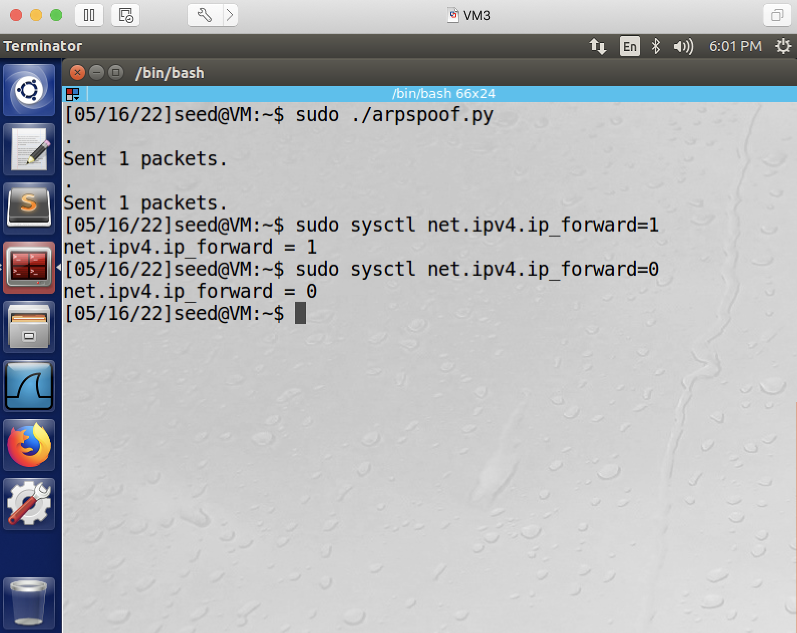
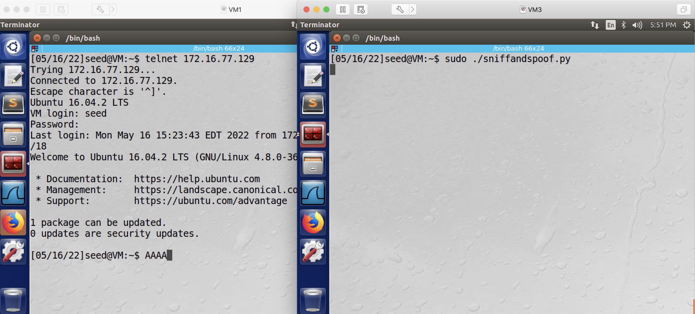

## ARP cache poisoning attack

### Requirement

in this lab, you will hijack a telnet session using the ARP cache poisoning attack.

### Setup

3 Linux VMs. VM1 as the victim (telnet client); VM2 as the telnet server; VM3 as the attacker. The 3 VMs reside in the same network. The following is the IP addresses and MAC addresses for the VMs used in this README.

| VM  |  IP address   |    MAC Address    |
-------------------------------------------
| VM1 | 172.16.77.128 | 00:0c:29:49:3b:46 |
| VM2 | 172.16.77.129 | 00:0c:29:74:1a:93 |
| VM3 | 172.16.77.130 | 00:0c:29:1d:8a:7b |

### Attack: 

1. The attacker, mimicking the client to send an ARP reply message to the server, and mimicking the server to send an ARP reply message to the client. You can use this script to send the two packets at once: http://cs.boisestate.edu/~jxiao/cs333/code/arp/arpspoof.py. You need sudo to run the script, and you also need to run "chmod +x arpspoof.py" to change it to an execuable.

```console
# sudo ./arpspoof.py
```

Note: You have to change the IP addresses and the MAC addresses in the above script, so as to reflect the correct information in your environment. The following are example screenshots, in total you need to change 6 lines:

before change:


after change:



Explanation: what this script does is: sends out a spoofed arp message to the server, which tells the server, the client's ip address is mapped to the attacer's mac address; sends out another spoofed arp message to the client, which tells the client, the server's ip address is mapped to the attacker's mac address.

2. From the client machine and from the server machine, run arp and ping commands to confirm the cache poisoning is successful.

```console
# arp
```

this screenshot shows that the poison is successful - from the server's perspective, the client's IP address (172.16.77.128) is mapped to the attacker's MAC address (00:0c:29:1d:8a:7b); from the client's perspective, the server's IP address (172.16.77.129) is also mapped to the attacker's MAC address (00:0c:29:1d:8a:7b).



```console
# ping client_ip (from the server) or ping server_ip (from the client) // ping command will fail here.
```

the screenshot shows that:


as can be seen from this screenshot, we get a 100% packet loss when running the ping command.

3: The attacker, turns on ip forwarding:

```console
# sudo sysctl net.ipv4.ip_forward=1
```

or as shown in the screenshot:



4: After turning on ip forwarding, from the client machine and the server machine, ping again to confirm the forwarding is working.

```console
# ping client_ip (from the server) or ping server_ip (from the client) // ping command will succeed here.
```

the screenshot shows that:


5: On the client machine, telnet to the server:

```console
# telnet server_ip
```

6: On the attacker's machine, turn off ip forwarding:

```console
# sudo sysctl net.ipv4.ip_forward=0
```

or as shown in the screenshot:



7: On the attackers' machine, run the sniff-and-spoof script. You can get this program from here: http://cs.boisestate.edu/~jxiao/cs333/code/arp/sniffandspoof.py

Note: Once again, you need to change the IP addresses and the MAC addresses in the above script, so as to reflect the correct information in your environment. And you need sudo to run the script, you also need to run "chmod +x sniffandspoof.py" to change it to an execuable.

```console
# sudo ./sniffandspoof.py
```

**Explanation**: what this script does is, sniffs the network, and captures every tcp packet exchanged between the client and the server: 1. for every packet goes from the client to the server, if its data contains letters, replaces each letter with a letter A; 2. for every packet goes from the server to the client, just forwards this packet to the client.

8: Now type in any commands on the client's machine, from the telnet connection. See what will happen - if your attack is successful, any alphabet character typed in from the client side will be converted into a letter "A". As shown in this screenshot:



**Troubleshooting tip**: If step 8 doesn't work, it's likely the poisoned cache entry has expired and you need to resend the poisoning packets.
