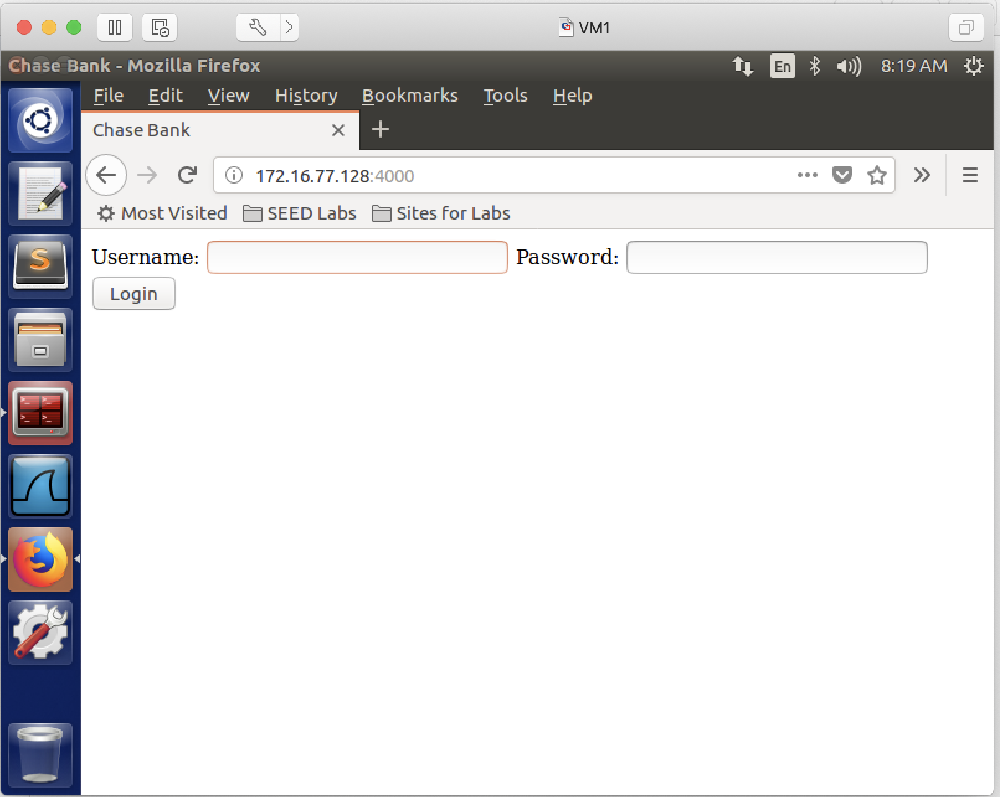
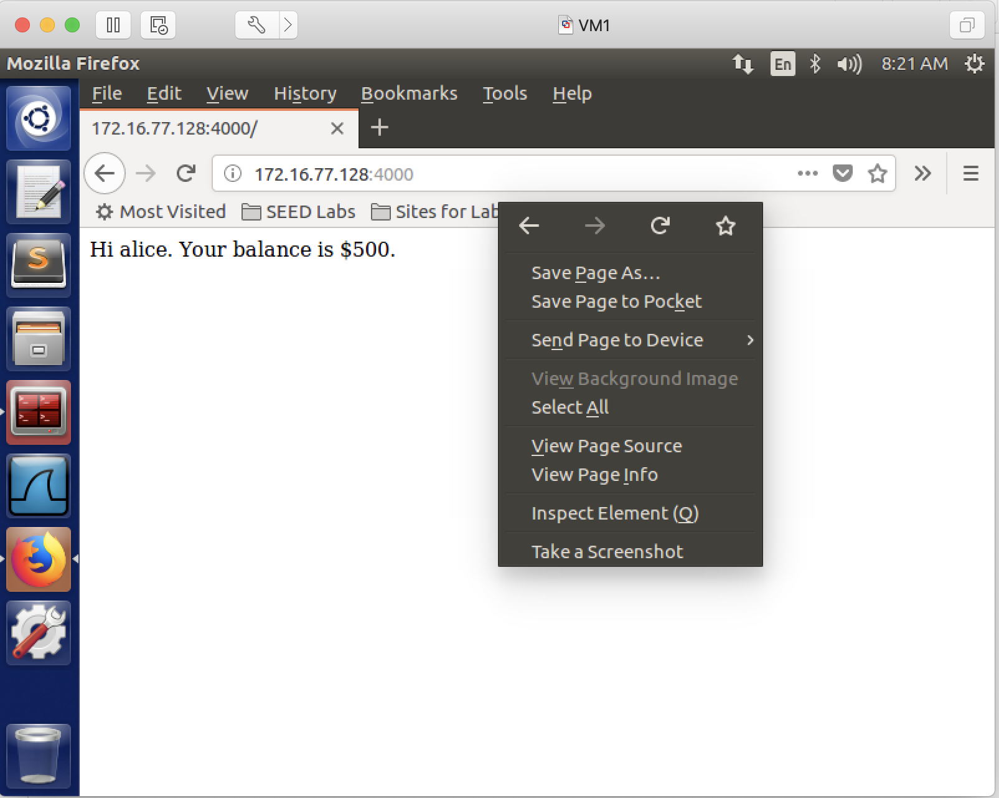
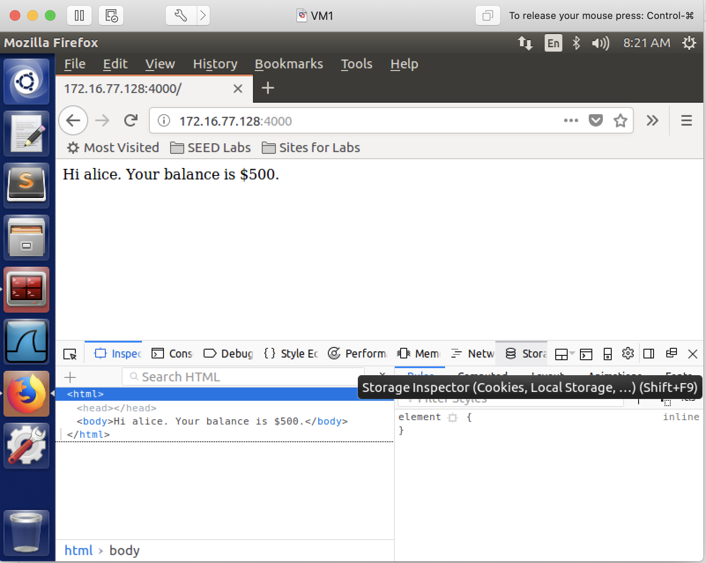
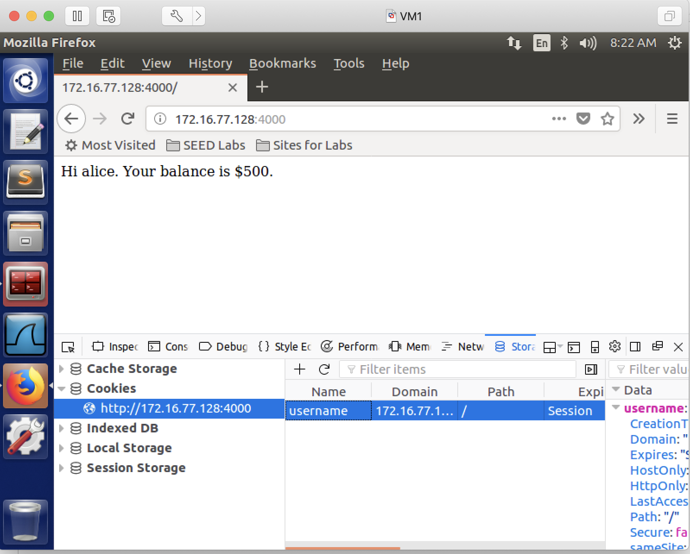
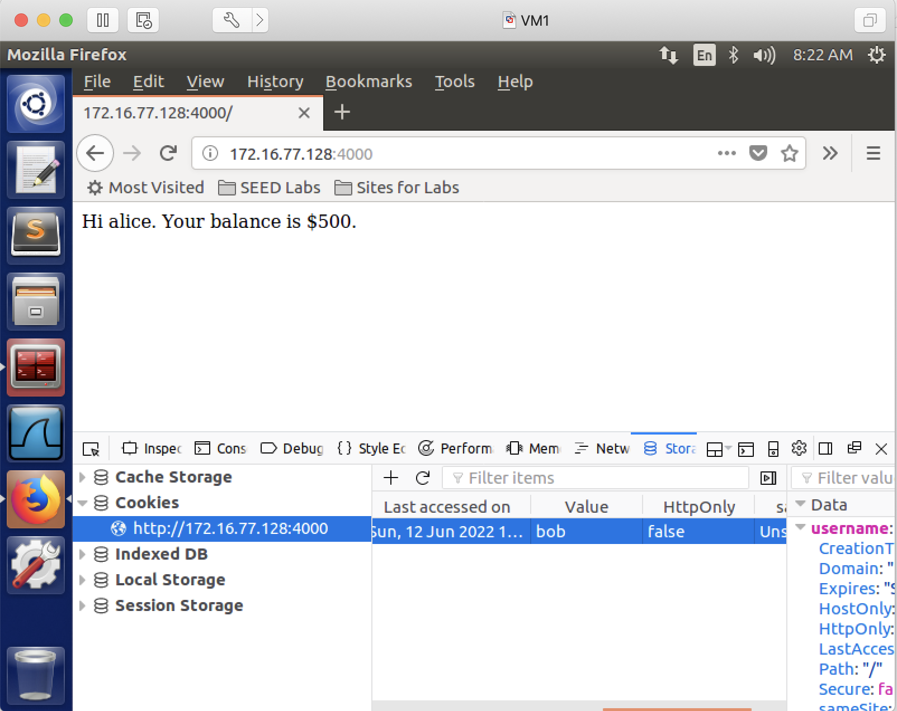
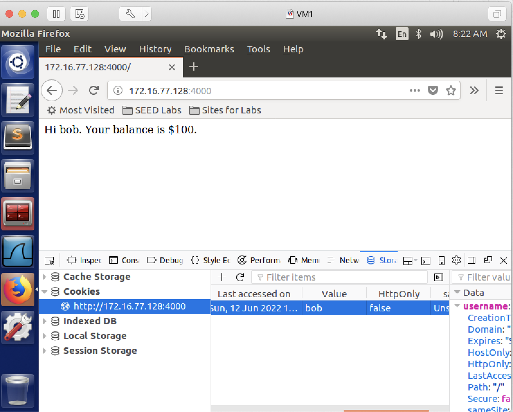

## Insecure HTTP Cookies

### Requirements 

In this lab, we will learn, when cookies are not designed/implemented properly, how insecure a web site can be. At the end of this lab, the attacker, without knowing the victim's password, will be able to find out the victim's bank account balance information.

### Setup

Only one VM is sufficient. We will run a web server in this VM. The web server runs an online banking website, the online banking website has two users, alice, and bob. The following is their username and password.

|  Username |  Password  | Balance | Role     |
|-----------|------------|---------|----------|
|  alice    |  password  | $500    | attacker |
|  bob      |  50505     | $100    | victim   |

### Steps

#### Preparation Steps

1. install node:

```console
[04/27/22]seed@VM:~$ sudo apt install nodejs-legacy
[04/27/22]seed@VM:~$ sudo apt install npm
[04/27/22]seed@VM:~$ npm install express
[04/27/22]seed@VM:~$ npm install cookie-parser
[04/27/22]seed@VM:~$ npm install body-parser
```

**Note**: if the above *npm* commands give you the following warnings, ignore them. It's not a problem.

```console
npm WARN enoent ENOENT: no such file or directory, open '/home/seed/package.json'
npm WARN seed No description
npm WARN seed No repository field.
npm WARN seed No README data
npm WARN seed No license field.
```

2. setup the web server:

```console
[04/27/22]seed@VM:~$ mkdir web 
[04/27/22]seed@VM:~$ cd web/
[04/27/22]seed@VM:~/banking$ wget http://cs.boisestate.edu/~jxiao/cs333/info/cookies/index.html.orig
[04/27/22]seed@VM:~/banking$ wget http://cs.boisestate.edu/~jxiao/cs333/info/cookies/server.js
```

3. start the web server:
```console
[04/27/22]seed@VM:~/banking$ mv index.html.orig index.html
[04/27/22]seed@VM:~/banking$ node server.js
```

4. access the website from the browser: type localhost:4000 (replace localhost with your VM's IP address), you should see this:



5. login as alice, username: **alice**, password: **password**. after login to the online banking site, alice can see her balance is $500. But can alice see bob's balance? let's try it without knowing bob's password, we can achieve this via modifying the cookies.

#### Attacking Steps

6. we, as alice, try to modify the cookie "username". we change its value from *alice* to *bob*. the following screenshots show how we change it.

6.1. first, we right click in the firefox window, and select **Inspect Element**.


6.2. next, we select **Storage**.


6.3. here, we can see cookies, and there is only one cookie, whose name is *username*. let's choose this cookie.


6.4. this cookie has several attributes, such as *Name*, *Domain*, *Path*, *Last accessed on*, *Value*. at this moment, as we can see, the *Value* is **alice**.


6.5. let's change the value to **bob**.


7. refresh the web page, and we should see bob's account balance, which is $100.



this shows that the attack is successful: alice doesn't know bob's password, but she now still can see bob's bank account balance.

### Lesson we learn

The lesson we learn from this lab is when designing cookies, we should avoid using the username as a cookie, or at least, it should not be stored in a plaintext format; as cookies can be changed from the client side, and the client could be a malicious actor.

### References:

CS253 Web Security – course created and taught by Feross Aboukhadijeh at Stanford University.
