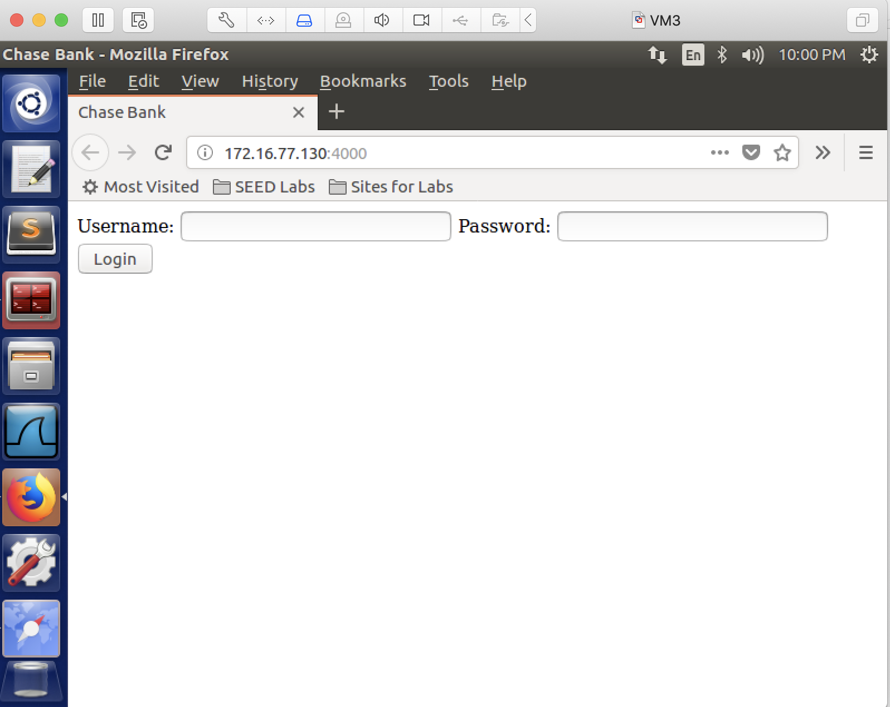
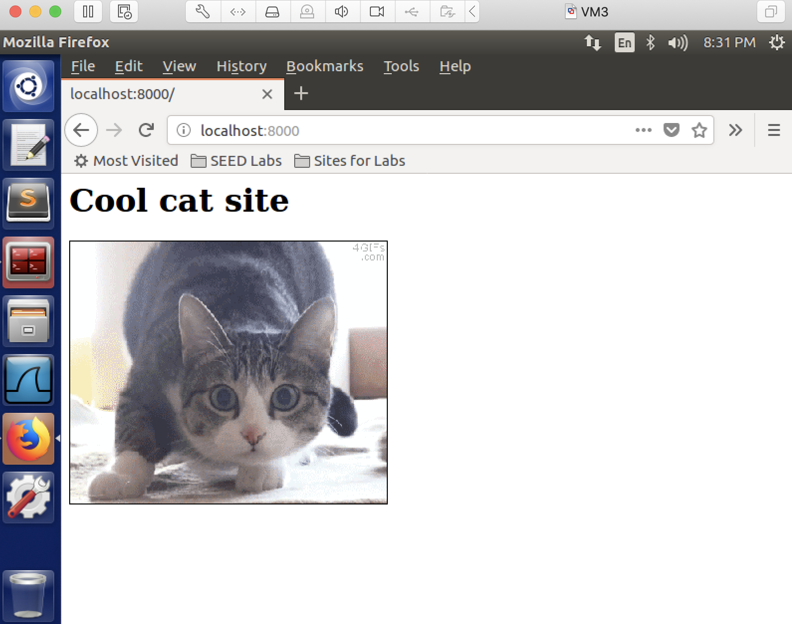

## Cross-site Request Forgery (CSRF Attack)

### Requirements 

In this lab, we assume your employee Bob has secretly downloaded some files into your network, but fortunately your wireshark has captured the suspicious traffic for you to analyze. You can download the capture file named forensics.pcapng from here: http://cs.boisestate.edu/~jxiao/cs333/info/tls/forensics.pcapng. Your goal is to find out the files (and their contents) Bob has downloaded. (Note that 10.142.0.3 is the private ip address assigned to Bob in your network.)

### Setup

Only one VM is sufficient.

### Steps

1. install node:

```console
[04/27/22]seed@VM:~$ sudo apt install nodejs-legacy
[04/27/22]seed@VM:~$ sudo apt install npm
[04/27/22]seed@VM:~$ npm install express
[04/27/22]seed@VM:~$ npm install cookie-parser
[04/27/22]seed@VM:~$ npm install body-parser
```

2. set up the banking website and start the banking webserver:

```console
[04/27/22]seed@VM:~$ mkdir banking
[04/27/22]seed@VM:~$ cd banking/
[04/27/22]seed@VM:~/banking$ wget http://cs.boisestate.edu/~jxiao/gencyber2021/index.html.orig
[04/27/22]seed@VM:~/banking$ wget http://cs.boisestate.edu/~jxiao/gencyber2021/server4.js
[04/27/22]seed@VM:~/banking$ mv index.html.orig index.html
[04/27/22]seed@VM:~/banking$ node server4.js
```

3. access the website from the browser: type localhost:4000, you should see this:



4. set up the attacker directory and start the attacker web server:

```console
[04/27/22]seed@VM:~$ mkdir attacker
[04/27/22]seed@VM:~$ cd attacker/
[04/27/22]seed@VM:~/attacker$ wget http://cs.boisestate.edu/~jxiao/gencyber2021/attacker/index.html.orig
[04/27/22]seed@VM:~/attacker$ wget http://cs.boisestate.edu/~jxiao/gencyber2021/attacker/cat.gif
[04/27/22]seed@VM:~/attacker$ wget http://cs.boisestate.edu/~jxiao/gencyber2021/attacker/attacker-frame.html
[04/27/22]seed@VM:~/attacker$ mv index.html.orig index.html
[04/27/22]seed@VM:~/attacker$ python -m SimpleHTTPServer 8000
```

5. access the website from the browser: open a new tab (make sure the banking site tab is still open), type localhost:8000, you should see this:




```console
[04/27/22]seed@VM:~$ node server4.js
```

### References:

CS253 Web Security – course created and taught by Feross Aboukhadijeh at Stanford University.
