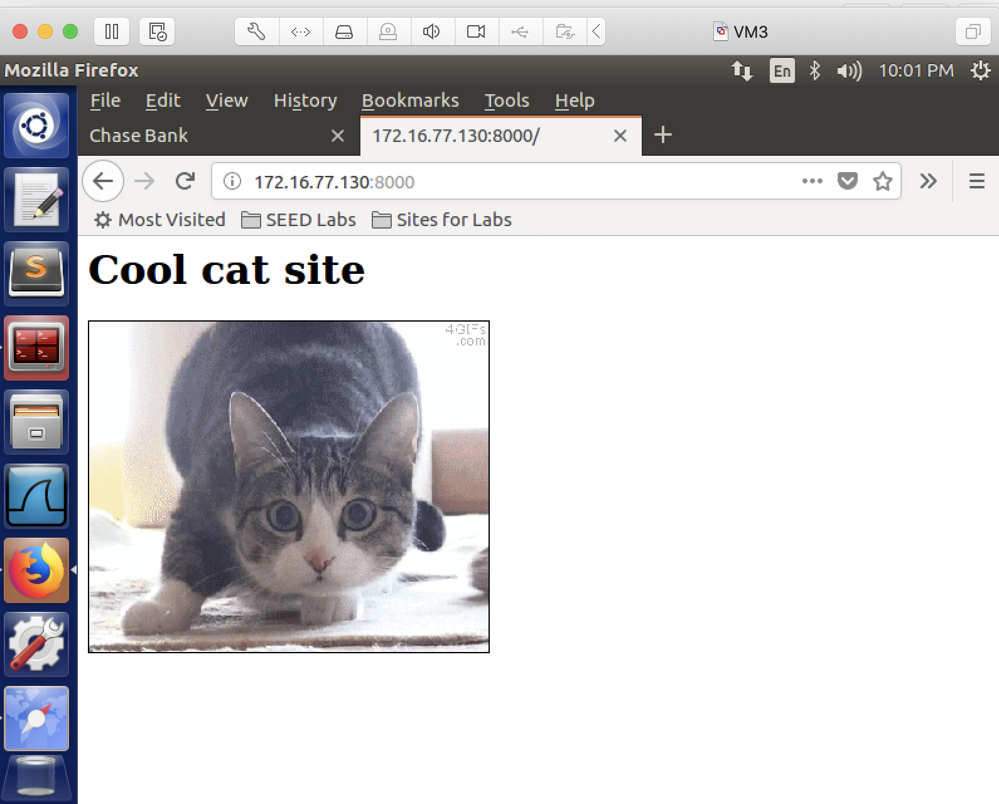

## Cross-site Request Forgery (CSRF Attack)

### Requirements 

In this lab, the victim is openning two tabs in the browser, one is an online banking website, another is the attacker's website. The victim is signed into the online banking website. The attacker will perform a CSRF attack against the victim. If the attack is successful, when the victim refreshes the attacker's web page, the victim's money (in the bank account) will disappear.

### Setup

Only one VM is sufficient.

### Steps

1. install node:

```console
[04/27/22]seed@VM:~$ sudo apt install nodejs-legacy
[04/27/22]seed@VM:~$ sudo apt install npm
[04/27/22]seed@VM:~$ npm install express
[04/27/22]seed@VM:~$ npm install cookie-parser
[04/27/22]seed@VM:~$ npm install body-parser
```

2. set up the banking directoy and start the banking webserver:

```console
[04/27/22]seed@VM:~$ mkdir banking
[04/27/22]seed@VM:~$ cd banking/
[04/27/22]seed@VM:~/banking$ wget http://cs.boisestate.edu/~jxiao/gencyber2021/index.html.orig
[04/27/22]seed@VM:~/banking$ wget http://cs.boisestate.edu/~jxiao/gencyber2021/server4.js
[04/27/22]seed@VM:~/banking$ mv index.html.orig index.html
[04/27/22]seed@VM:~/banking$ node server4.js
```

3. access the website from the browser: type localhost:4000, you should see this:


4. login as jessica, username: jessica, password: 50505. You should see that Jessica's account balance at this moment is $10,000.

5. set up the attacker directory and start the attacker web server:

```console
[04/27/22]seed@VM:~$ mkdir attacker
[04/27/22]seed@VM:~$ cd attacker/
[04/27/22]seed@VM:~/attacker$ wget http://cs.boisestate.edu/~jxiao/gencyber2021/attacker/index.html.orig
[04/27/22]seed@VM:~/attacker$ wget http://cs.boisestate.edu/~jxiao/gencyber2021/attacker/cat.gif
[04/27/22]seed@VM:~/attacker$ wget http://cs.boisestate.edu/~jxiao/gencyber2021/attacker/attacker-frame.html
[04/27/22]seed@VM:~/attacker$ mv index.html.orig index.html
[04/27/22]seed@VM:~/attacker$ python -m SimpleHTTPServer 8000
```

6. access the website from the browser: open a new tab (make sure the banking site tab is still open), type localhost:8000, you should see this:



7. refresh the attacker's page, and then refresh the banking page, if the attack is successful, jessica's account balance should have less money now.

(if the firefox browser doesn't show the amount change, try a different browser installed in the provided VM).

### References:

CS253 Web Security – course created and taught by Feross Aboukhadijeh at Stanford University.
