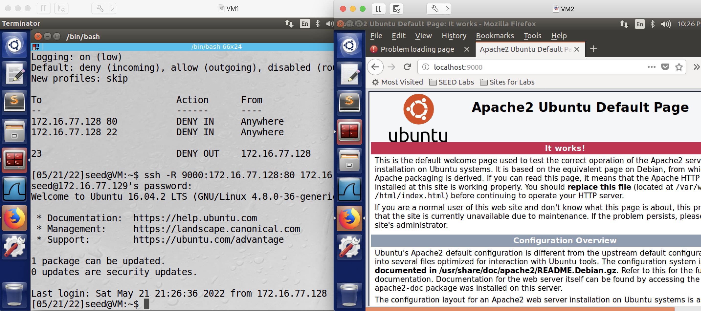
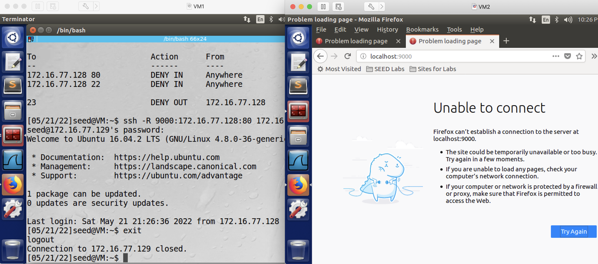

## Bypass Firewall with ssh Tunnels

### Requirement

In this lab, you will bypass a firewall that has an egress filtering rule, and two ingress filtering rules.

### Setup

3 Linux VMs: VM1, VM2, VM3. Firewall runs on VM1.

#### Setup for Task 1

| VM  |  IP Address   |                  Role                                |
|-----|---------------|------------------------------------------------------|
| VM1 | 172.16.77.128 |  telnet client, which also runs firewall             |
| VM2 | 172.16.77.129 |  ssh server, through which we create the ssh tunnel  |
| VM3 | 172.16.77.130 |  telnet server, which the client wants to access     |

#### Setup for Task 2

| VM  |  IP Address   |                  Role                                                               |
|-----|---------------|-------------------------------------------------------------------------------------|
| VM1 | 172.16.77.128 |  web server, which also runs firewall                                               |
| VM2 | 172.16.77.129 |  web client, which also runs an ssh server, through which we create the ssh tunnel  |
| VM3 | 172.16.77.130 |  not used in task 2                                                                 |

### Task 1

telnet from VM1 to VM3 is blocked, but we still want to do telnet from VM1 to VM3.

### Steps for Task 1

1. enable firewall on VM1.

```console
# sudo ufw enable
```


2. setup the firewall on VM1 so that telnet is not allowed from VM1 to anywhere, which of course includes VM3.

```console
# sudo ufw deny out from VM1_IP to any port 23
```

**Note**: you can use this command to verify your setting is correct:

```console
# sudo ufw status verbose
```

3. on VM1, test if you can telnet to VM3, you should fail - because of the above firewall setting.

```console
# telnet VM3_IP
```

as can be seen from the screenshot, the blocking rule is added, and telnet thus fails. 


4. setup an ssh tunnel to evade the firewall. On VM1, run:

```console
# ssh -L 8000:VM3_IP:23 VM2_IP
```

this screenshot shows the command:


**Explanation**: this command will establish an ssh connection from VM1 to VM2, and it also tells ssh, any connection to local port 8000 of VM1 will now be forwarded, by the ssh server running on VM2, to port 23 of VM3.

5. On VM1, open a different terminal, telnet to VM3 using the following command:

```console
# telnet localhost 8000
```

this screenshot shows the command:


6. After the above command, login and then run ifconfig to verify you are indeed connected to VM3.

```console
# ifconfig
```

as this screenshot shows, now the ip address is VM3's ip address, which proves the telnet connection is successful.


### Task 2

a web server is (by default) running on VM1 at port 80, yet incoming traffic to port 80 and port 22 are both blocked by the firewall. Our goal is to evade the firewall so we can access the web server running on VM1 from VM2. For this task, we only need VM1 and VM2: VM1 is the web server, VM2 is the web client.

### Steps for Task 2

6: setup the firewall on VM1 so that any incoming requests to port 80 and port 22 on VM1 are blocked.

```console
# sudo ufw deny in from any to VM1_IP port 80
# sudo ufw deny in from any to VM1_IP port 22
```


once again, you can use this command to verify your setting is correct:

```console
# sudo ufw status verbose
```

as the screenshot shows, 2 new rules are added:


and then on VM2:

```console
# ssh VM1_IP
```

as can be seen from the screenshot, the blocking rule is added, and ssh thus fails:


and because ssh from VM2 to VM1 is blocked, we can not establish an ssh tunnel like we did in task 1. Therefore *ssh -L* does not work in this scenario, which is why now we resort to another approach, which is to establish a reverse ssh tunnel.

7. on VM2, open firefox, and in the firefox address bar type: VM1_IP, see if you can access the web server running on VM1 - due to the above firewall setting, you should not be able to:


8. on VM1, setup a reverse ssh tunnel to evade the firewall:

```console
# ssh -R 9000:VM1_IP:80 VM2_IP
```

this screenshot shows the command:


**Explanation**: this command will establish an ssh connection from VM1 to VM2, and it also tells ssh, any connection to remote port 9000 of VM2, will now be forwarded, by the ssh server running on VM2, to port 80 of VM1.

**Troubleshooting**: Here if you can't ssh from VM1 to VM2, it's likely you didn't change /etc/default/ufw, refer to slides: DEFAULT_INPUT_POLICY needs to be changed from DROP to ACCEPT. After changing the file, you may need to reload ufw:

```console
# sudo ufw reload
```

9. on VM2, now open firefox, and in the firefox address bar type: localhost:9000, see if you can access the web server running on VM1. Expected result: your access should be successful, as can be seen from this screenshot:



10. On VM1, exit the ssh tunnel, and go back to VM2's firefox window (but remember to clear cache first) and see if you still can access the web server running on VM1 - you should not be able to:



Note 3: you are recommended to remove all the firewall rules at the end of this lab, so that the firewall doesn't affect your future experiments in this class. To remove all rules:

```console
# sudo ufw reset
# sudo ufw disable
# sudo ufw status verbose
```
