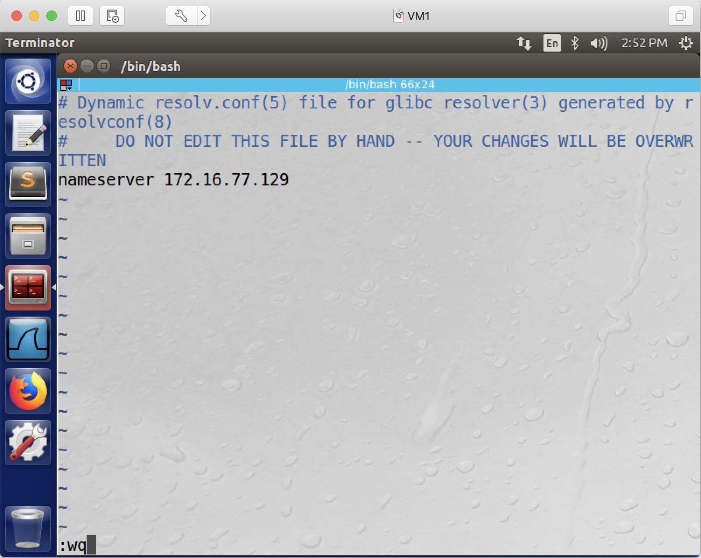
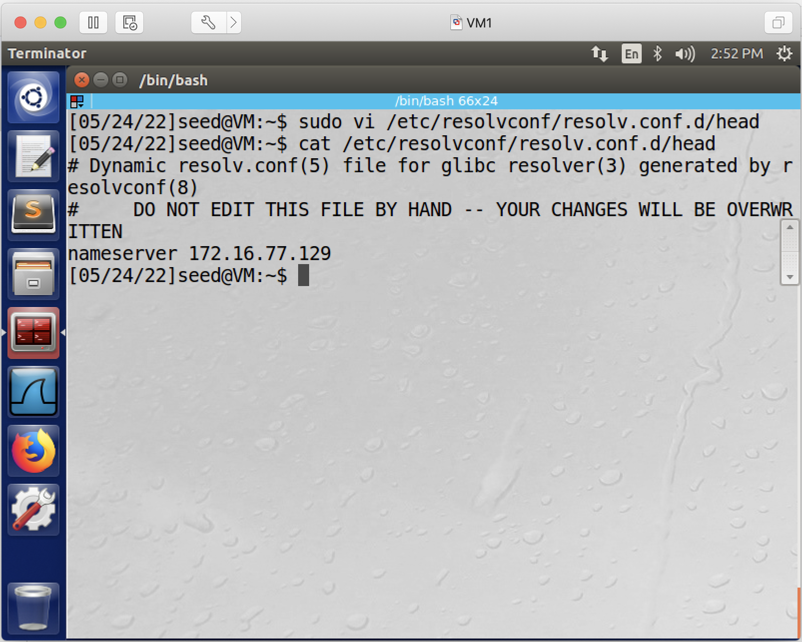
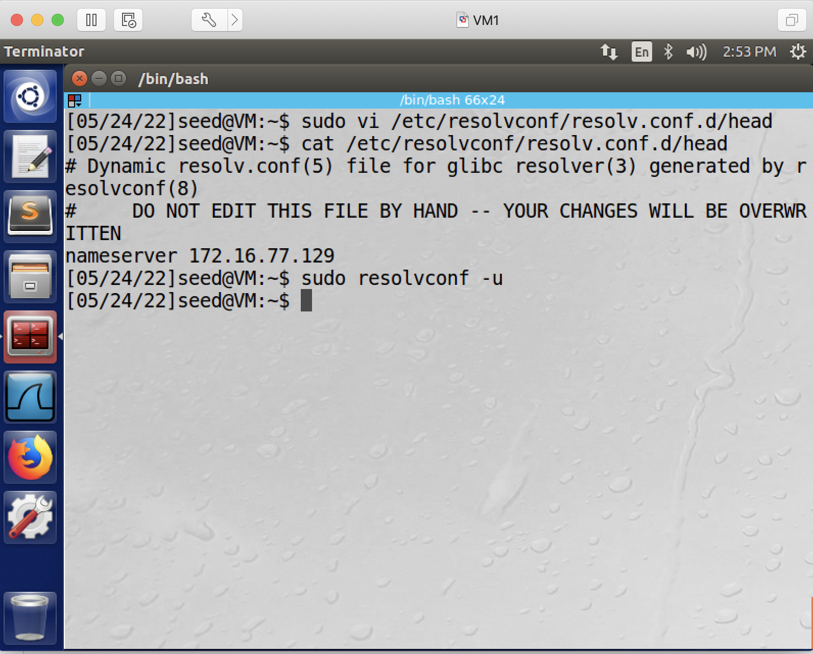

## Remote DNS Cache Poisoning Attack (aka, the Dan Kaminsky Attack)

### Requirement

In this lab, you will poison the cache of a local DNS server, and thus affect clients who rely on this DNS server. More specifically, we want clients who access www.cnn.com go to fakenews.com.

### Setup

3 Linux VMs: victim (DNS) client, victim (DNS) server, attacker. All 3 VMs are located in the same network - however, we are not allowed to exploit this fact for the attacks, in other words, the attacker in this lab is not allowed to use wireshark to sniff any packets, or use the *netwox* command to inject forged DNS responses. After all, this lab is trying to demonstrate how attackers from a remote network can still perform DNS cache poisoning.

The following is the IP addresses for the VMs used in this README.

| VM  |  IP Address   |              Role                     |
|-----|---------------|---------------------------------------|
| VM1 | 172.16.77.128 |   victim DNS client                   |
| VM2 | 172.16.77.129 |   victim DNS server                   |
| VM3 | 172.16.77.130 |   attacker, attacker's DNS server     |

### Special Notes

1. in this lab, you need to copy several files from this github repository into either your victim DNS server VM, or into your attacker VM, thus it is more convenient if you just clone this repository on your victim DNS server VM, and also clone this same repository on your attacker VM.

2. many of the commands in this lab require *sudo*.

### Steps

1. on victim DNS client, configure DNS server information, i.e., let the client know the IP address of the victim DNS server.

1.1. add this line to the end of file /etc/resolvconf/resolv.conf.d/head (remember to replace DNS_SERVER_IP with your victim DNS server's IP address, plus, you need "sudo" if you edit the file using vi/vim.)

```console
nameserver DNS_SERVER_IP
```

this screenshot shows editing the file in *vi*:


this screenshot shows the file is now edited:


1.2. run the following command so the above change will take effect:

```console
[05/29/22]seed@VM:~$ sudo resolvconf -u
```



2. setting up the local DNS server.

2.1. add the following into /etc/bind/named.conf (so that it forwards all requests for the attacker32.com domain to the malicious DNS server).

```console
zone "attacker32.com" {
    type forward;
    forwarders {
        172.16.77.130; // replace 172.16.77.130 with your attacker VM's IP address, do not remove the ";".
    };
};
```

**Explanation**: the added lines are saying, for DNS queries regarding this attacker32.com domain, please forward the queries to 172.16.77.130. we do this so that we don't need to actually purchase the domain attacker32.com.

2.2. copy named.conf.options into the /etc/bind/ directory, and also copy named.conf.default-zones into the /etc/bind/ directory.

```console
[05/29/22]seed@VM:~/.../remotedns$ sudo cp named.conf.options /etc/bind/
[05/29/22]seed@VM:~/.../remotedns$ sudo cp named.conf.default-zones /etc/bind/
```

**Explanation**: these two files will overwrite the default files, and with these two files, now the victim DNS server is configured to forward all DNS requests to 1.2.3.4, which does not provide DNS services, and then later on the attacker will impersonate 1.2.3.4 to send forged responses to the victim DNS server.

2.3. restart DNS server so the above changes will take effect:

```console
[05/29/22]seed@VM:~/.../remotedns$ sudo service bind9 restart
```

**Warning**: in your report, don't claim that the attack presented in this lab is not realistic because we need to make these changes on the victim DNS server. Such changes are unnecessary in a real life attacking scenario. The lab is designed in such a way, just to save you - the student, some money - so you don't need to purchase a domain, and to save you - the student, some time, we hardcoded 1.2.3.4 in the configuration file of the victim DNS server and also in the attacking program, otherwise you will need to manually to find out the IP address of authoritative name server for cnn.com.

3. setting up the attacker DNS server.

3.1. copy attacker32.com.zone and cnn.com.zone into the /etc/bind/ directory.

```console
[05/29/22]seed@VM:~/.../remotedns$ sudo cp attacker32.com.zone /etc/bind/
[05/29/22]seed@VM:~/.../remotedns$ sudo cp cnn.com.zone /etc/bind/
```

Remember to replace 172.16.77.130 in attacker32.com.zone with your attacker VM's IP address.

3.2. add the following into /etc/bind/named.conf (so that the above two configuration files will be used):

```console
zone "attacker32.com" {
    type master;
    file "/etc/bind/attacker32.com.zone";
};

zone "cnn.com" {
    type master;
    file "/etc/bind/cnn.com.zone";
};
```

3.3. restart attacker's DNS server so the above changes will take effect:

```console
[05/29/22]seed@VM:~/.../remotedns$ sudo service bind9 restart
```

4. on victim DNS client, send two queries.

```console
[05/29/22]seed@VM:~$ dig www.cnn.com 
```

```console
[05/29/22]seed@VM:~$ dig @ns.attacker32.com www.cnn.com
```

the first *dig* command should show you the legitimate mapping: 


whereas the second *dig* command should show you that www.cnn.com is mapped to 188.126.71.216, which as of 05/29/2022, is the IP address of fakenews.com:


the goal of this attack is, when the victim DNS client runs either of the above two commands, the victim DNS client will get the same result, i.e., www.cnn.com is mapped to the IP address of fakenews.com.

5. right before we start the attack, let's clear the victim DNS server's cache. on the victim DNS server, run:

```console
[05/29/22]seed@VM:~/.../remotedns$ sudo rndc flush
```

6. launch the attack: on the attacker's VM, run the attacking program, which is developed based on the famous Dan Kaminsky attack.

```console
[05/29/22]seed@VM:~/.../remotedns$ gcc -o attack attack.c
[05/29/22]seed@VM:~/.../remotedns$ sudo ./attack 172.16.77.130 172.16.77.129
```

**Note**: replace 172.16.77.130 with your attacker VM's IP address, replace 172.16.77.129 with your victim DNS server VM's IP address.

7. the attack may take a couple of minutes. on victim DNS server VM, we can check the cache to verify if the cache is poisoned or not.

```console
[05/29/22]seed@VM:~$ sudo rndc dumpdb -cache
[05/29/22]seed@VM:~$ cat /var/cache/bind/dump.db | grep attacker
ns.attacker32.com.	9992	\-AAAA	;-$NXRRSET
; attacker32.com. SOA ns.attacker32.com. admin.attacker32.com. 2008111001 28800 7200 2419200 86400
cnn.com.		65529	NS	ns.attacker32.com.
; ns.attacker32.com [v4 TTL 1792] [v6 TTL 9992] [v4 success] [v6 nxrrset]
```

as long as we see this *NS* record which associates cnn.com. to ns.attacker32.com., then we know the cache is now poisoned.

8. we can then verify the result from the victim DNS client. on the victim DNS client VM, we just need to send two queries.

```console
[05/29/22]seed@VM:~$ dig www.cnn.com 
```

```console
[05/29/22]seed@VM:~$ dig @ns.attacker32.com www.cnn.com
```

if the attack is successful, then these two commands should now show the same result, which is www.cnn.com is mapped to 188.126.71.216, which as of 05/29/2022, is the IP address of fakenews.com.

the following screenshots show that the attack is successful:


9. you are recommended to remove the line you added on the victim DNS client VM in step 1, in this file: /etc/resolvconf/resolv.conf.d/head, so that your future experiments won't be affected.

10. you are also recommended to restore the two files on the victim DNS server VM:

```console
[05/29/22]seed@VM:~/.../remotedns$ sudo cp named.conf.options.orig /etc/bind/
[05/29/22]seed@VM:~/.../remotedns$ sudo cp named.conf.default-zones.orig /etc/bind/
```
