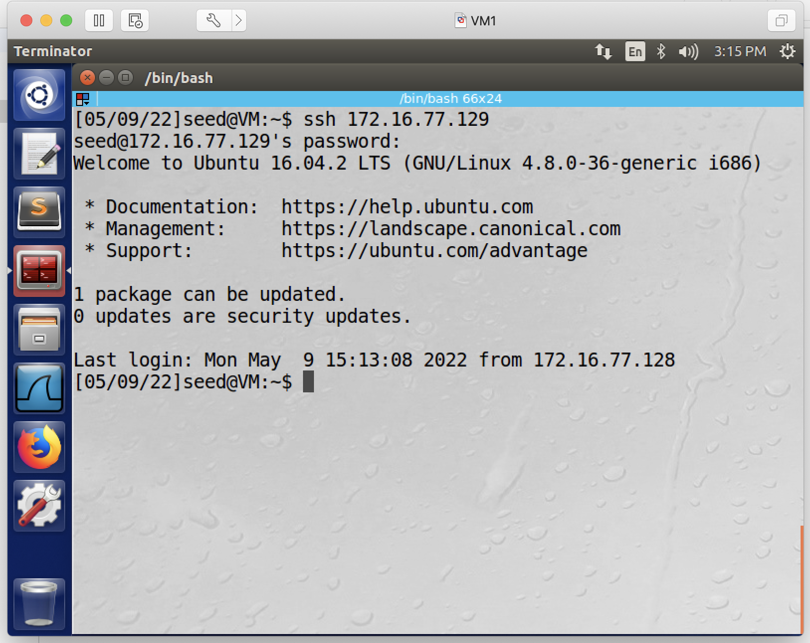
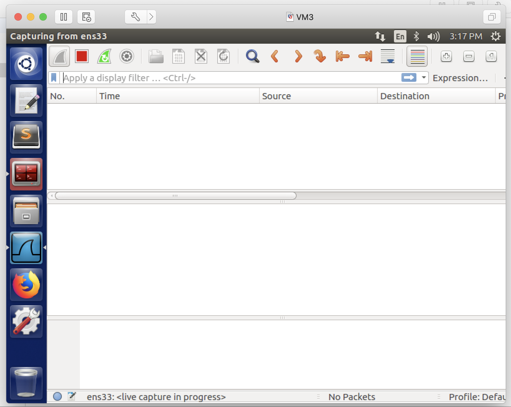
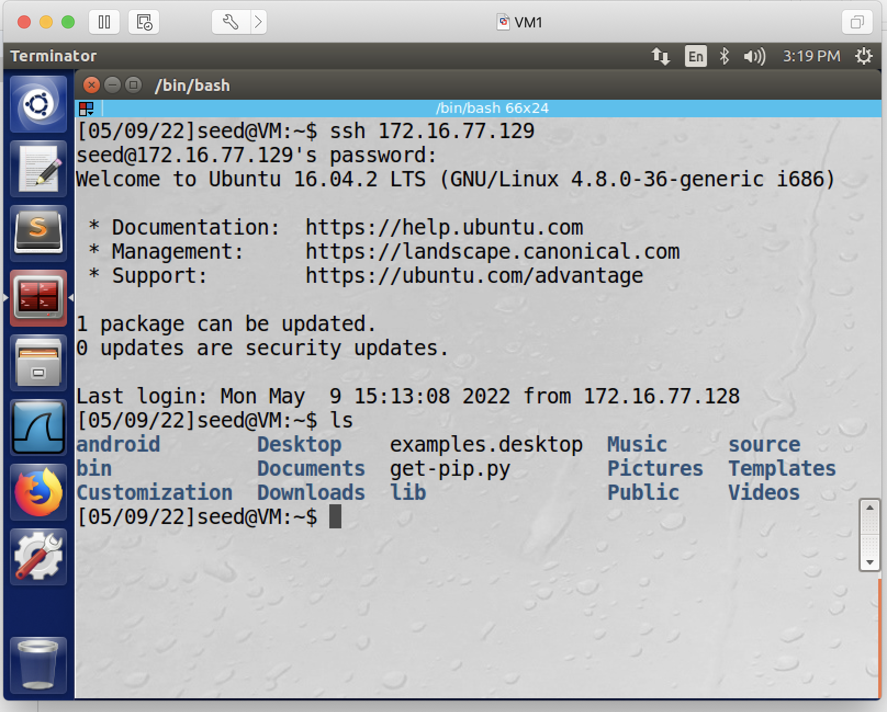
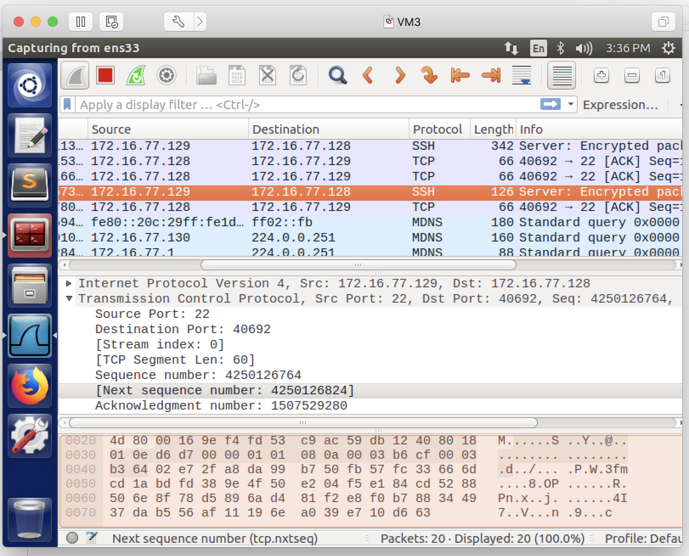
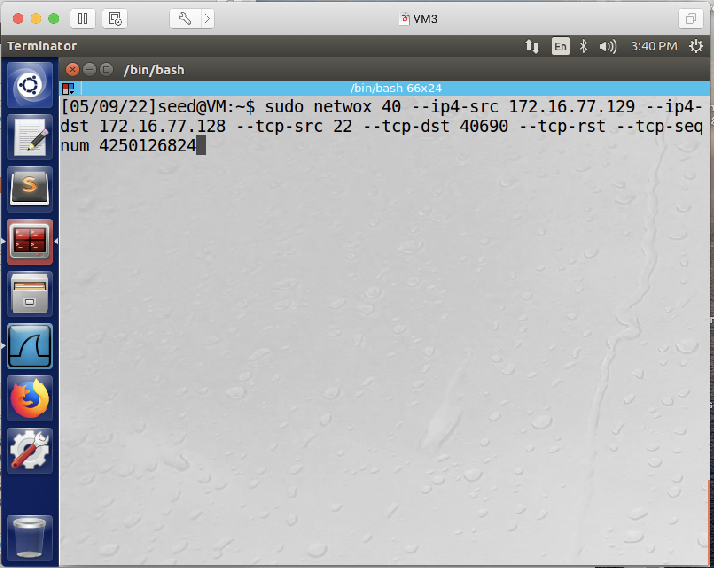
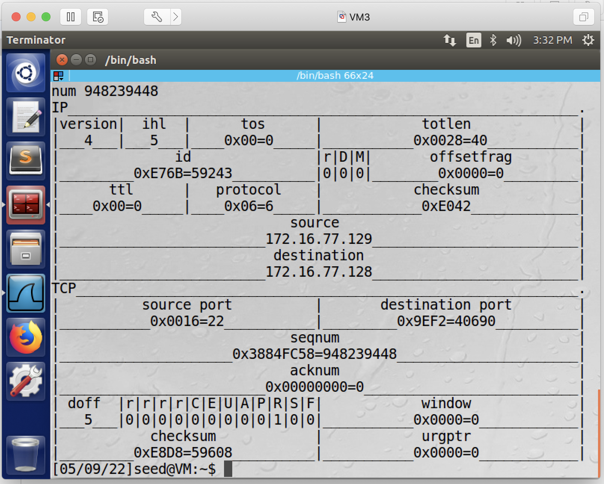
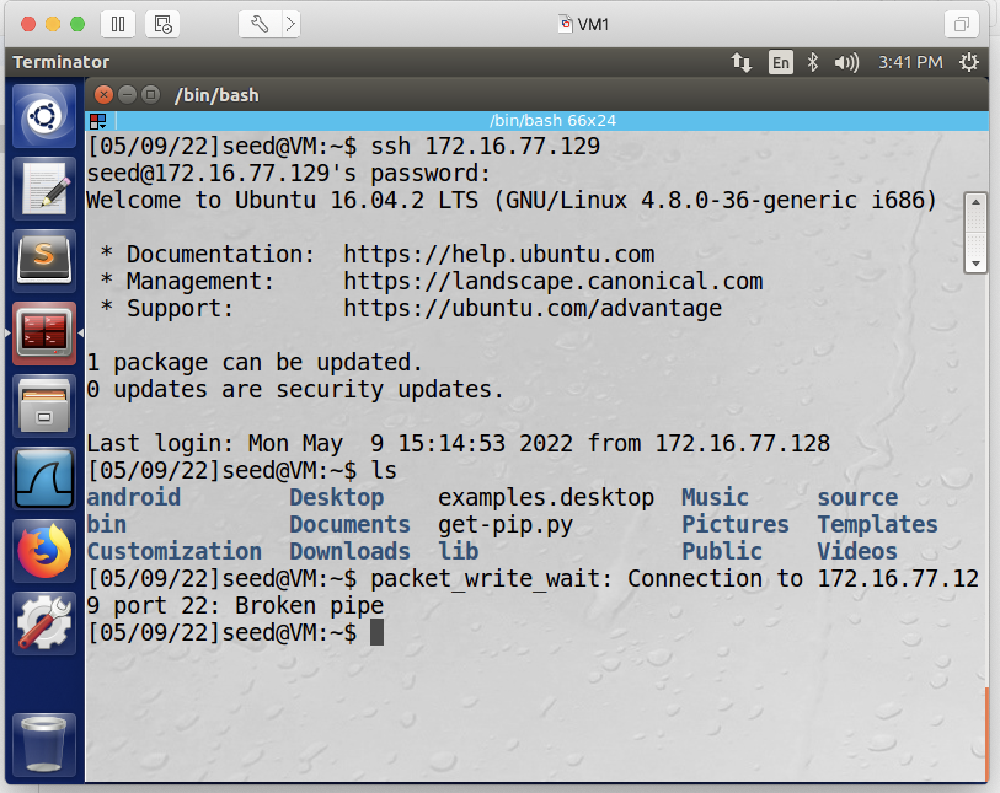

## TCP Reset Attack

### Requirements 

In this lab, we will break an ssh connection between the victim client and the ssh server.

### Setup

3 Linux VMs. VM1 as the victim (ssh client); VM2 as the ssh server; VM3 as the attacker. The 3 VMs reside in the same network.

### Steps

1. let the client connect to the server using ssh.

2. let the attacker start monitoring network traffic using wireshark.

3. client produces some ssh packets. (any ssh packets, you can just type a command like ls).

4. attacker stops wireshark capturing, and navigates to the latest packet sent from the server to the client.

5. the above packet provides the information which the attacker needs to know in order to perform the tcp reset attack. now, the attacker, mimicking the server, only needs to send one single RST packet to the client. To send a TCP reset packet, the attacker needs to use the *netwox 40* command. The command should be in this format: # sudo netwox 40 --ip4-src *source_ip* --ip4-dst *destination_ip* --tcp-src *source_port* --tcp-dst *destination_port* --tcp-rst --tcp-seqnum *sequence_number*. Remember to replace these italic texts with information captured in wireshark. To run the command, the attacker opens a terminal window, types the *netwox 40* command, and press enter.

- before pressing enter:

**Note**: because the attacker is mimicking the server, thus the source ip address needs to be the server's IP address; and the sequence number needs to be the *next sequence number* as seen in wireshark: as we can see from wireshark, the *next sequence number* is *4250126814*.

- after pressing enter:

6. once the attacker pressed enter to execute the above *netwox 40* command, if the attack is successful, the victim client's ssh connection will be disrupted, and the victim client is expected to see this on the terminal:

This indicates that the attack is successful and concludes the lab. The client is no longer connected to the ssh server.
