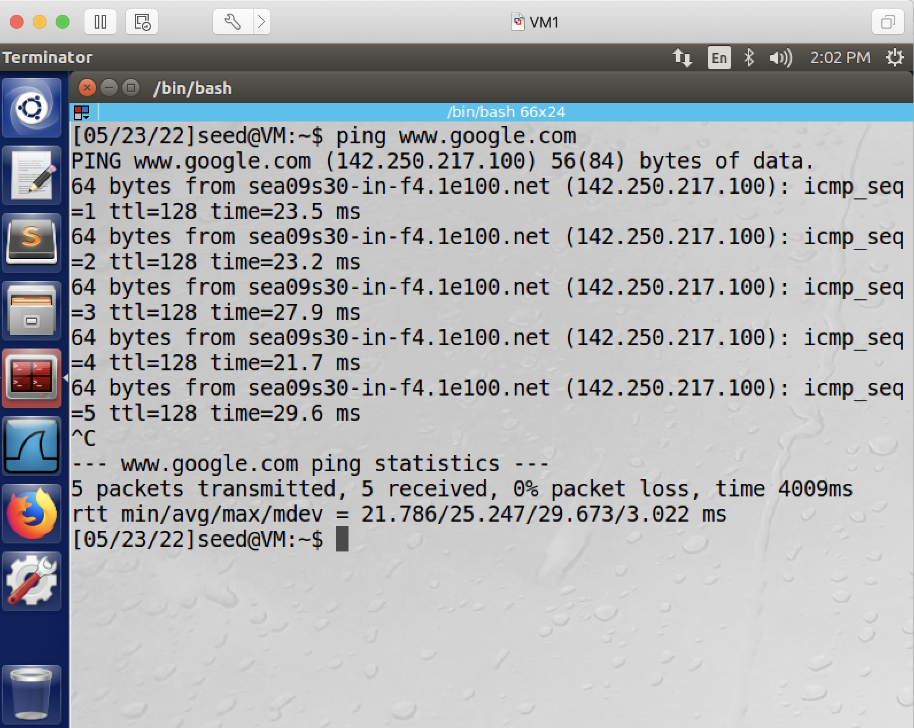
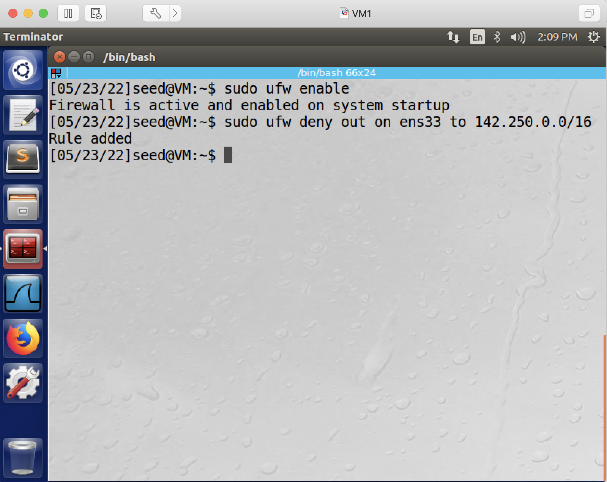
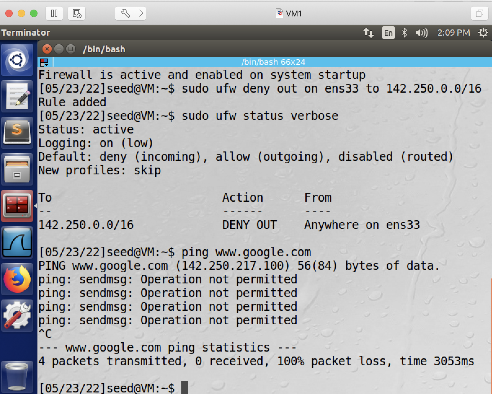
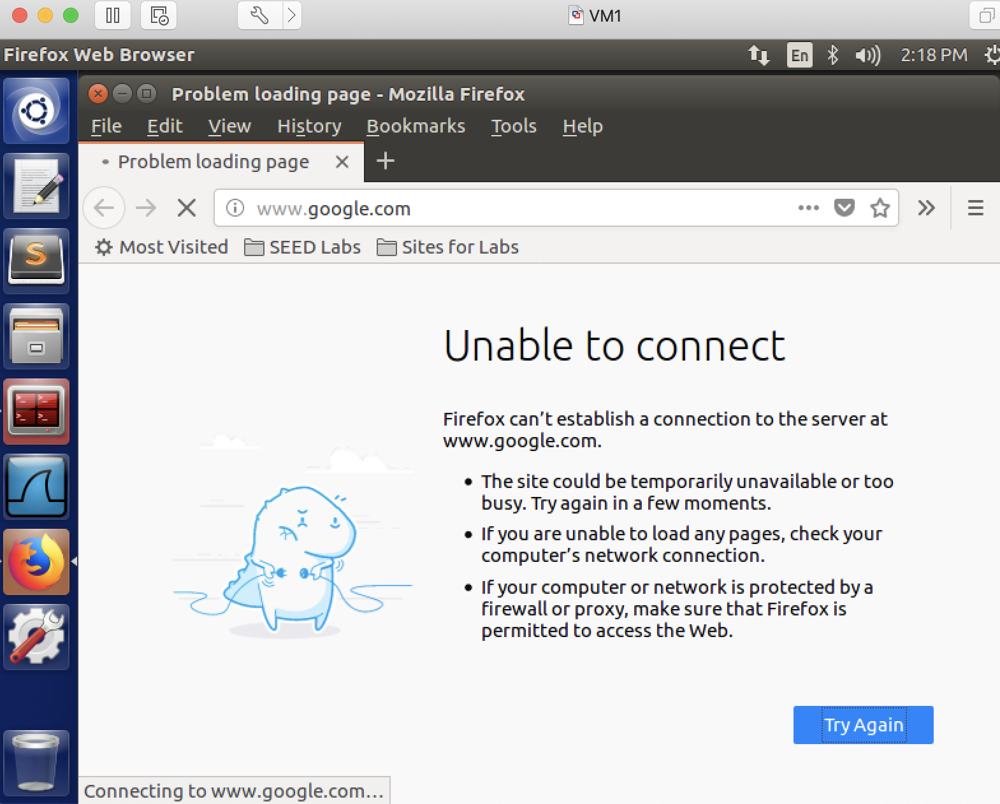
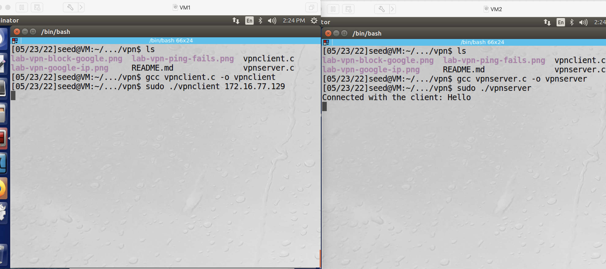
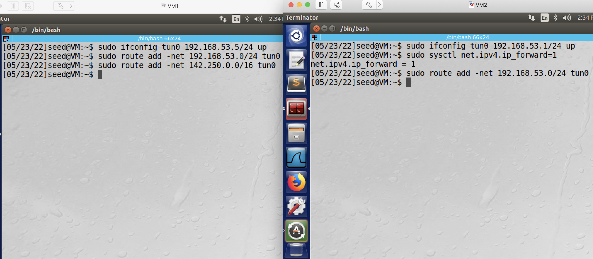
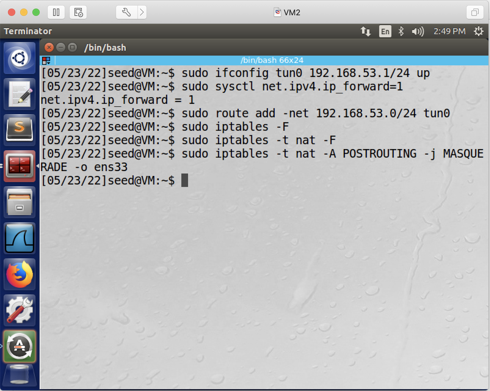
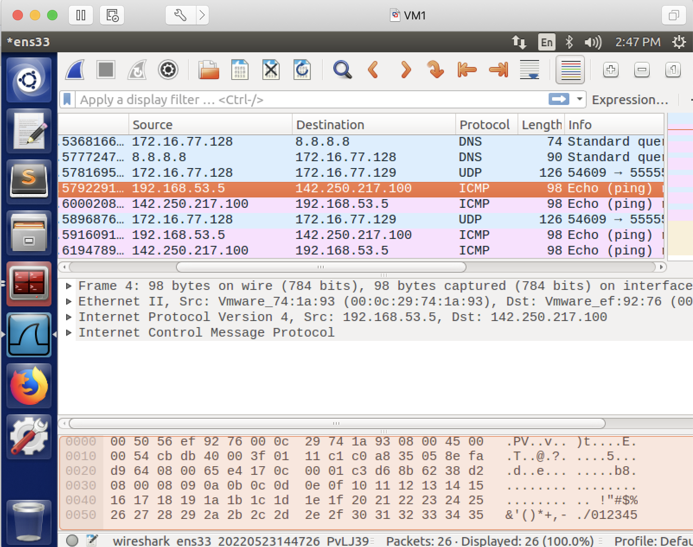
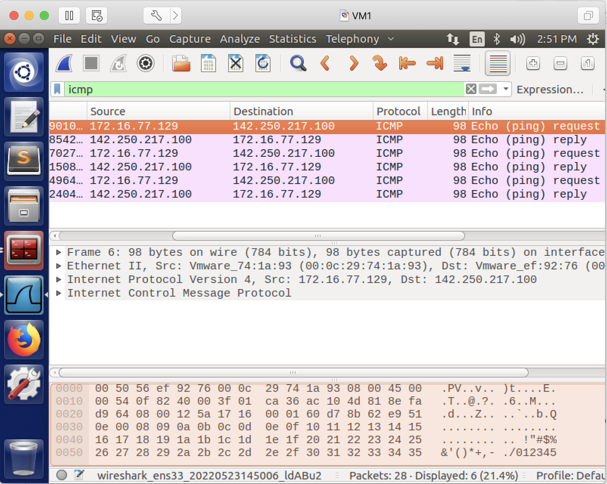
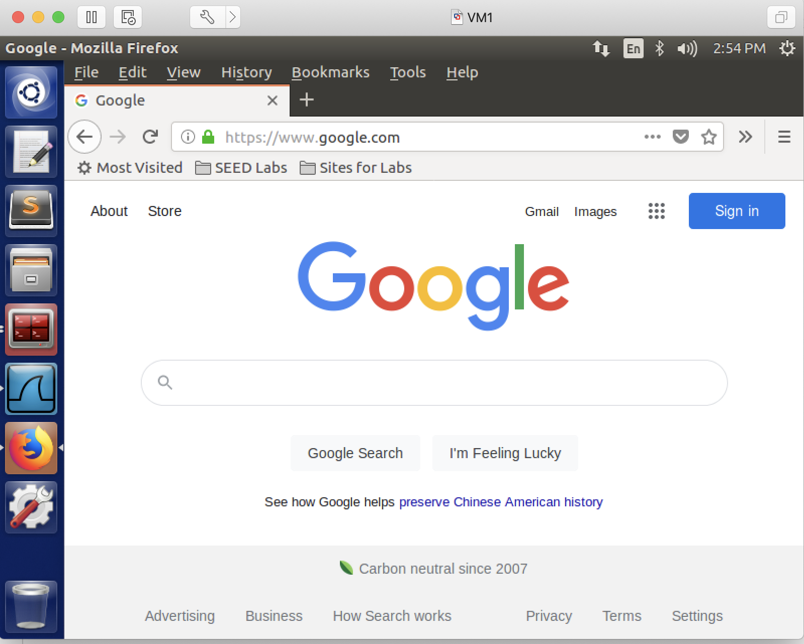

## Bypass Firewall Using VPN

### Requirement

In this lab, you will bypass a firewall that has an egress filtering rule, which blocks VM1 from accessing www.google.com.

### Setup

2 Linux VMs: VM1, VM2. Firewall runs on VM1. VM1 serves as VPN client, VM2 serves as VPN server.

| VM  |  IP Address   |                Role               | Default Network Interface Card |
|-----|---------------|-----------------------------------|--------------------------------|
| VM1 | 172.16.77.128 |  VPN client, also runs firewall   |            ens33               |
| VM2 | 172.16.77.129 |  VPN server                       |            ens33               |

### Steps

1. enable firewall on VM1.

```console
# sudo ufw enable
```

2. setup the firewall on VM1 so that www.google.com is blocked.

```console
# sudo ufw deny out on ens33 to google_network
```

**Note**: if your VM's NIC is not ens33, change ens33 here to your NIC's name. You need to do so for all remaining steps - replace ens33 with your NIC's name whenever you see ens33 in this lab.

**Note 2**: google has more than 1 IP address, therefore it makes more sense to block a network, rather than a single IP address. You can just ping www.google.com to find out google's IP address, if google's IP address is 172.217.5.196, then you can assume 172.217.0.0/16, or 172.217.5.0/24 is google's network - or the range of IP addresses owned by google.

this screenshot shows, on this specific day, when I was pinging Google from my VM, I get 142.250.217.100 - once again, you need to use ping to find out what IP address Google is using - your answer could be very different from mine:



and thus the command I used to block Google's network, was:



3. you can use this command to verify your setting is correct:

```console
# sudo ufw status verbose
# ping www.google.com
```

ping should fail here because of the above firewall setting:



4. open the firefox browser on VM1 and try to access www.google.com - you should fail - because of the above firewall setting:



5. On VM2, download the vpnserver program (http://cs.boisestate.edu/~jxiao/cs333/code/vpn/vpnserver.c), compile the vpnserver program and run it.

```console
# gcc vpnserver.c -o vpnserver
# sudo ./vpnserver
```

6. on VM1: download the vpnclient program (http://cs.boisestate.edu/~jxiao/cs333/code/vpn/vpnclient.c), compile the vpnclient program and run it.

```console
# gcc vpnclient.c -o vpnclient
# sudo ./vpnclient server_ip // remember to replace server_ip with your VPN server's IP.
```

this screenshot shows when the client and server are connected, a hello message is printed on the server side.



7. on VM2, open a new terminal and configure the tun interface; and then enable ip forwarding.

```console
# sudo ifconfig tun0 192.168.53.1/24 up
# sudo sysctl net.ipv4.ip_forward=1
```

**Explanation**: the first command sets up a tun0 interface, whose ip address is 192.168.53.1, whose subnet mask is 24, a.k.a., 255.255.255.0; the second command turns on ip forwarding.

8. still on VM2, set up a routing rule for the 192.168.53.0/24 network.

```console
# sudo route add -net 192.168.53.0/24 tun0
```

**Explanation**: this command adds a routing rule to the system saying that any traffic goes to 192.168.53.0/24 should go through the network interface tun0; without this routing rule, such traffic will go through the default network interface card.

9. on VM1, open a new terminal and configure the tun interface.

```console
# sudo ifconfig tun0 192.168.53.5/24 up
```

**Explanation**: this command sets up a tun0 interface, whose ip address is 192.168.53.5, whose subnet mask is 24, a.k.a., 255.255.255.0.

10. still on VM1, set up a routing rule for the 192.168.53.0/24 network. Also add another routing rule for www.google.com packets to be sent through the tunnel.

```console
# sudo route add -net 192.168.53.0/24 tun0
# sudo route add -net google_network tun0
```

**Explanation**: the first command is the same as the one you just typed in step 6. In step 6, you ran it on VM2, which is the VPN server; in step 7, you run it on VM1, which is the VPN client; the second command says, any traffic goes to the google network should go through the network interface tun0.

this screenshot shows all of the above ifconfig, route, and sysctl commands:



once again, on this specific day, from my VM, I found 142.250.0.0/16 is google's network address, it doesn't mean, from your VM's perspective, on a different day, 142.250.0.0/16 is still google's network address. You should use whatever you found and used in step 2.

11. now, at this moment, if you ping www.google.com, you ping packets will go to google, but you won't be able to get the responses. in order to see the responses, we need to setup NAT on the VPN server, i.e., VM2.

```console
# sudo iptables -F		// Flush existing iptables rules.
# sudo iptables -t nat -F	// Flush existing iptables rules in the nat table.
# sudo iptables -t nat -A POSTROUTING -j MASQUERADE -o ens33 
```



Explanation of the above iptables command:

-t nat	 	select table "nat" for configuration of NAT rules. iptables defines several tables, table "filter" is the default table, which is for configuring firewall rules; table "nat" is for configuring NAT rules.

-A POSTROUTING	append a rule to the POSTROUTING chain (The NAT table contains PREROUTING chain, POSTROUTING chain, and OUTPUT chain). the PREROUTING chain is responsible for packets that just arrived at the network interface; whereas the POSTROUTING chain is responsible for packets that are about to leave this machine.

-o ens33	this rule is valid for packets that leave on the network interface ens33 (-o stands for "output")

-j MASQUERADE	the action that should take place is to 'masquerade' packets, i.e. replacing the sender's address with the NAT server's address.

Overall, this command says, when forwarding packets, replace the sender's address with this current VM's ip address (the address that is associated with ens33).

the following screenshots show when we ping www.google.com, what we see in wireshark, before setting up NAT vs after setting up NAT:

before setting up nat:



after setting up nat:



as you can see, after setting up nat, when forwarding ICMP packets to Google, VM2 changes 192.168.53.5 to 172.16.77.129 when sending out ICMP packets.

12. On VM1, use the firefox browser to access www.google.com - this time you should succeed, as shown in the screenshot:



13. once again, you're recommended to reset your firewall on VM1 and NAT on VM2, so they don't affect your future experiments:

on VM1:
```console
# sudo ufw reset
# sudo ufw disable
# sudo ufw status verbose
```

on VM2:
```console
# sudo iptables -t nat -F
# sudo iptables -t nat -L
```
